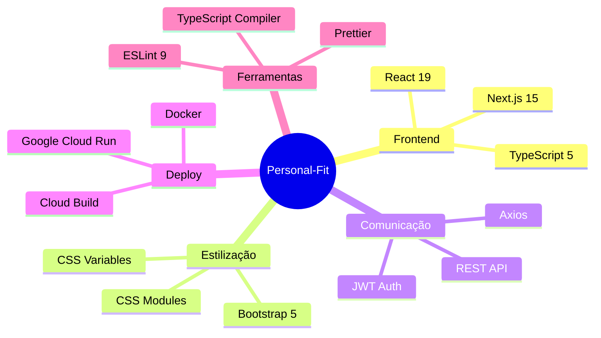
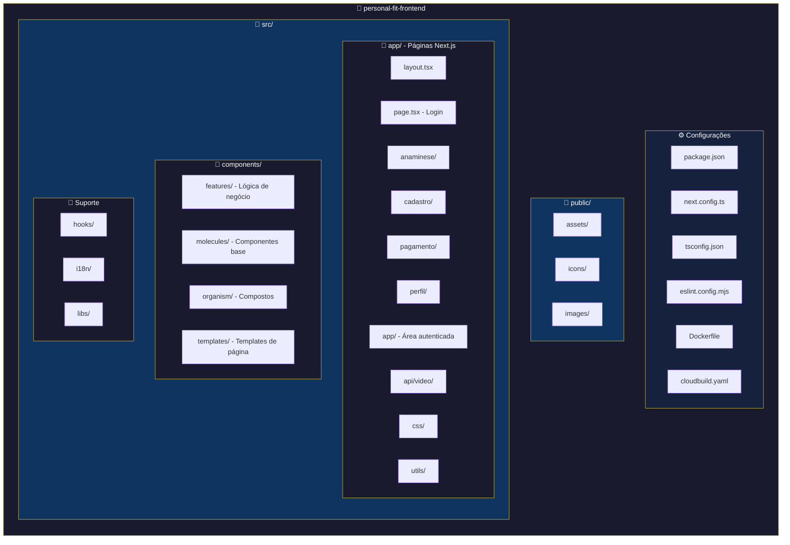
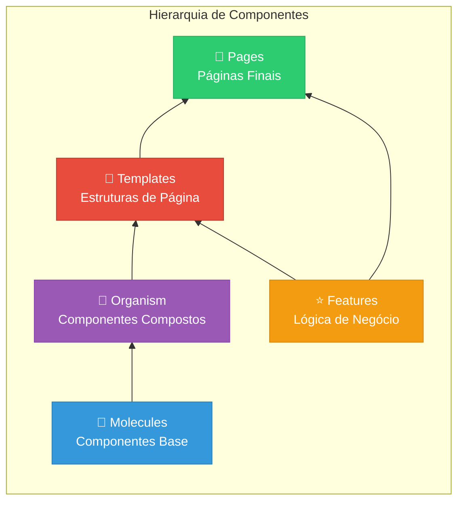
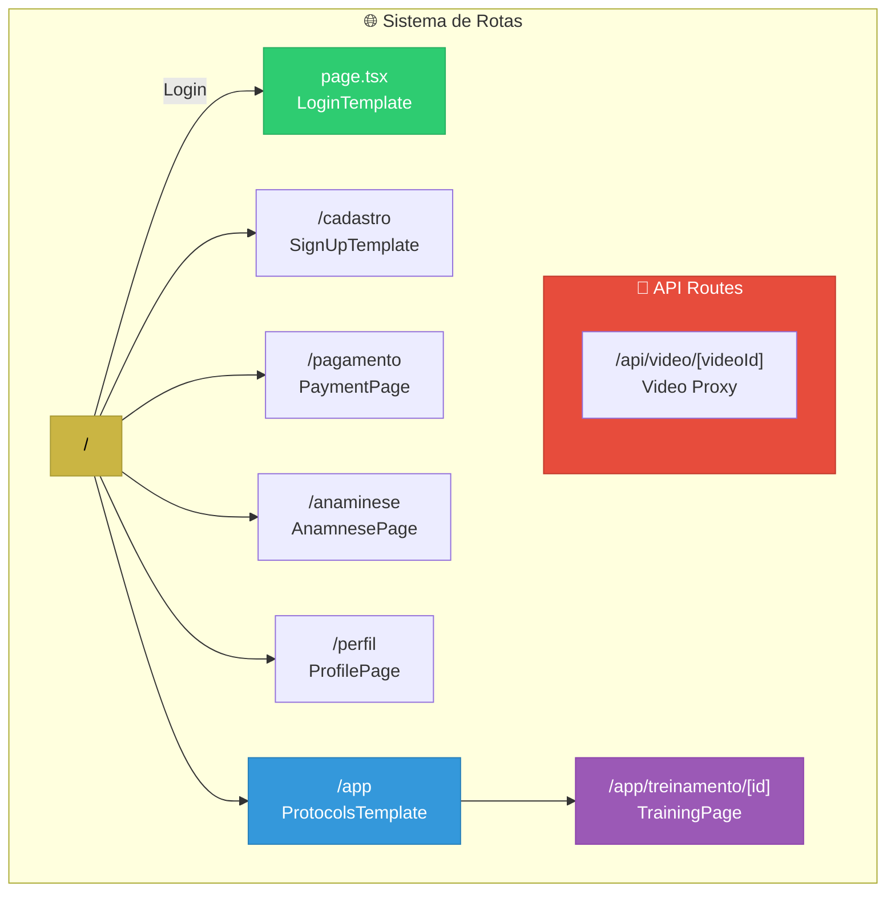
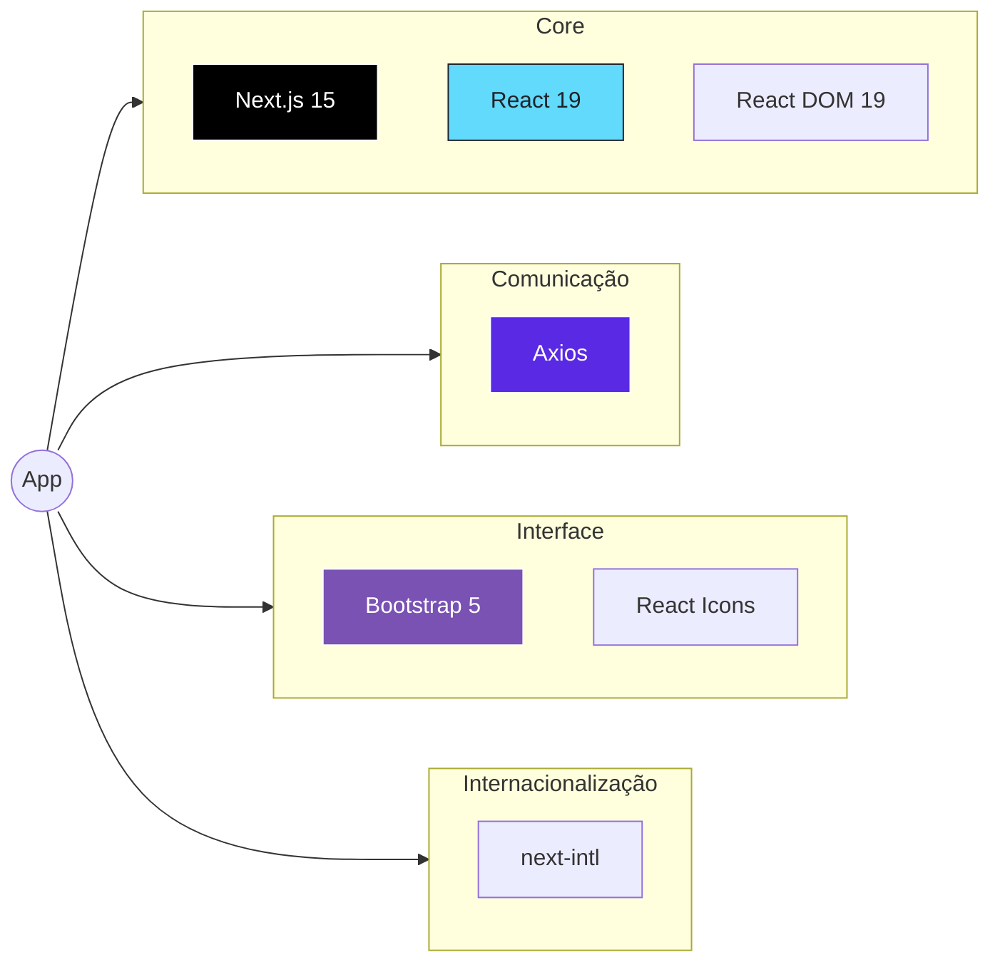
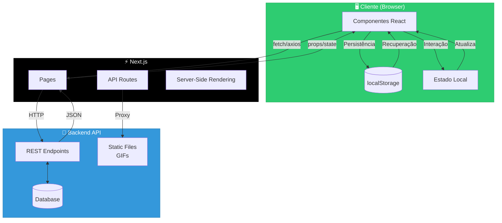
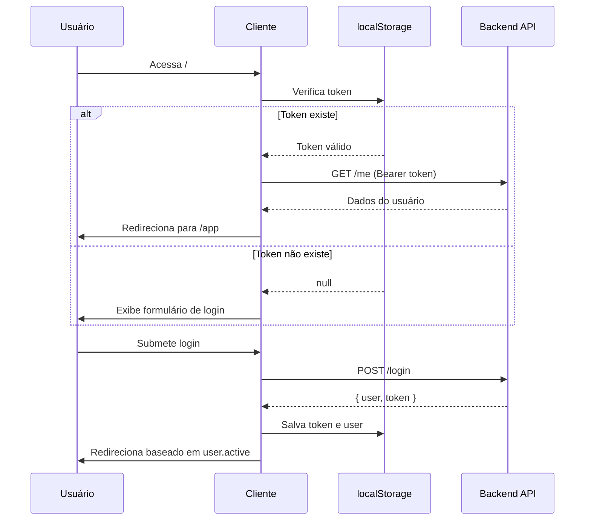
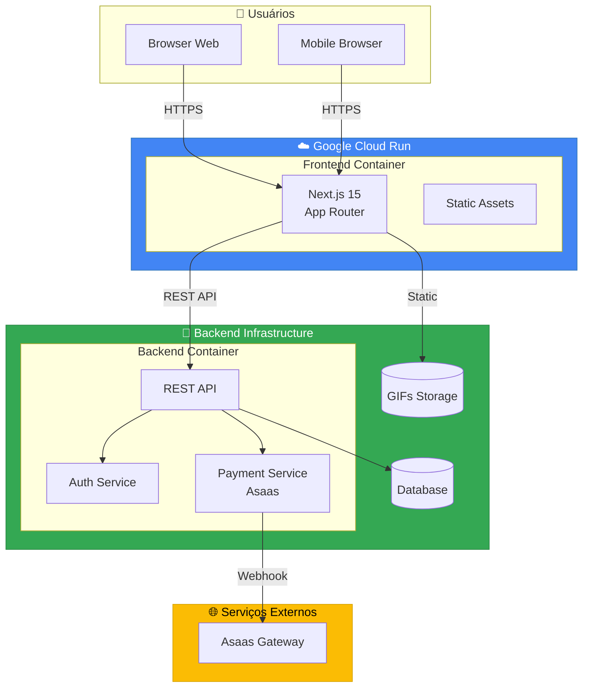

# 📐 Arquitetura do Projeto - Personal-Fit Frontend

> **Versão:** 1.0.0  
> **Última atualização:** 23 de Dezembro de 2025  
> **Autor:** Documentação Técnica

---

## Índice

1. [Visão Geral](#1-visão-geral)
2. [Stack Tecnológica](#2-stack-tecnológica)
3. [Estrutura de Pastas](#3-estrutura-de-pastas)
4. [Padrão Atomic Design](#4-padrão-atomic-design)
5. [Arquitetura Next.js App Router](#5-arquitetura-nextjs-app-router)
6. [Configurações do Projeto](#6-configurações-do-projeto)
7. [Dependências](#7-dependências)
8. [Fluxo de Dados](#8-fluxo-de-dados)
9. [Diagrama de Arquitetura Geral](#9-diagrama-de-arquitetura-geral)

---

## 1. Visão Geral

**Personal-Fit** é uma plataforma de treinamento fitness que permite aos usuários:

- Realizar cadastro e autenticação
- Responder questionário de anamnese (avaliação de saúde)
- Assinar planos de treinamento via pagamento com cartão de crédito
- Visualizar protocolos de treino personalizados
- Acompanhar exercícios com GIFs demonstrativos
- Fazer anotações pessoais por exercício
- Receber exercícios recomendados baseados em áreas de dor

### Características Principais

| Característica   | Descrição                     |
| ---------------- | ----------------------------- |
| **Framework**    | Next.js 15+ com App Router    |
| **Renderização** | Híbrida (SSR + CSR)           |
| **Plataforma**   | Google Cloud Run (Serverless) |
| **Estilização**  | CSS Modules + Bootstrap 5     |
| **API**          | REST via Axios                |
| **Autenticação** | JWT Bearer Token              |

---

## 2. Stack Tecnológica

### 2.1 Tecnologias Core



### 2.2 Tabela de Versões

| Tecnologia      | Versão      | Propósito                   |
| --------------- | ----------- | --------------------------- |
| **Next.js**     | ^15.1.0     | Framework React com SSR/SSG |
| **React**       | ^19.0.0     | Biblioteca de UI            |
| **TypeScript**  | ^5          | Tipagem estática            |
| **Axios**       | ^1.8.4      | Cliente HTTP                |
| **Bootstrap**   | ^5.3.3      | Framework CSS               |
| **next-intl**   | ^4.0.2      | Internacionalização         |
| **react-icons** | ^5.5.0      | Biblioteca de ícones        |
| **Node.js**     | 20 (Alpine) | Runtime de execução         |

### 2.3 Ambiente de Desenvolvimento

| Ferramenta       | Versão | Descrição            |
| ---------------- | ------ | -------------------- |
| **ESLint**       | ^9     | Linting de código    |
| **Prettier**     | 3.5.3  | Formatação de código |
| **@types/node**  | ^20    | Tipos Node.js        |
| **@types/react** | ^19    | Tipos React          |

---

## 3. Estrutura de Pastas

### 3.1 Diagrama de Hierarquia



### 3.2 Estrutura Detalhada

```
personal-fit-frontend/
│
├── 📄 Configurações Raiz
│   ├── package.json              # Dependências e scripts
│   ├── next.config.ts            # Config Next.js
│   ├── tsconfig.json             # Config TypeScript
│   ├── eslint.config.mjs         # Config ESLint
│   ├── Dockerfile                # Build container
│   ├── cloudbuild.yaml           # CI/CD Cloud Build
│   ├── Procfile                  # Comando de start
│   └── project.toml              # Buildpacks config
│
├── 📂 public/                    # Assets estáticos
│   └── assets/
│       ├── icons/                # Ícones SVG/PNG
│       └── images/               # Imagens do projeto
│
├── 📂 src/                       # Código fonte
│   │
│   ├── 📂 app/                   # Next.js App Router
│   │   ├── layout.tsx            # Layout raiz
│   │   ├── page.tsx              # Página inicial (Login)
│   │   │
│   │   ├── 📂 anaminese/         # Questionário de saúde
│   │   │   └── page.tsx
│   │   │
│   │   ├── 📂 cadastro/          # Registro de usuário
│   │   │   └── page.tsx
│   │   │
│   │   ├── 📂 pagamento/         # Módulo de pagamento
│   │   │   ├── page.tsx          # Seleção de plano
│   │   │   ├── interface.ts      # Tipos de pagamento
│   │   │   ├── styles.css        # Estilos
│   │   │   └── paymentTypes/     # Métodos de pagamento
│   │   │       ├── CreditCard.tsx
│   │   │       └── pix.tsx
│   │   │
│   │   ├── 📂 perfil/            # Perfil do usuário
│   │   │   ├── page.tsx
│   │   │   └── styles.css
│   │   │
│   │   ├── 📂 app/               # Área autenticada
│   │   │   ├── page.tsx          # Lista de protocolos
│   │   │   └── treinamento/      # Módulo de treino
│   │   │       ├── page.tsx      # Redirecionamento
│   │   │       └── [id]/         # Treino dinâmico
│   │   │           ├── page.tsx
│   │   │           └── TrainingPage.module.css
│   │   │
│   │   ├── 📂 api/               # API Routes
│   │   │   └── video/
│   │   │       └── [videoId]/
│   │   │           └── route.ts  # Proxy de vídeo
│   │   │
│   │   ├── 📂 css/               # Estilos globais
│   │   │   ├── globals.css
│   │   │   └── constants.css
│   │   │
│   │   └── 📂 utils/             # Utilitários
│   │       └── api.ts            # Cliente HTTP Axios
│   │
│   ├── 📂 components/            # Componentes React
│   │   │
│   │   ├── 📂 features/          # Componentes de negócio
│   │   │   ├── ExerciciosRecomendados.tsx
│   │   │   ├── ExerciseDetailCard.tsx
│   │   │   ├── ExerciseDetailCard.module.css
│   │   │   ├── TrainingCard.tsx
│   │   │   ├── TrainingCard.module.css
│   │   │   ├── TrainingProtocol.tsx
│   │   │   ├── TrainingProtocol.module.css
│   │   │   ├── TrainingProtocolList.tsx
│   │   │   ├── TrainingProtocolList.module.css
│   │   │   └── types.tsx         # Tipos compartilhados
│   │   │
│   │   ├── 📂 molecules/         # Componentes atômicos
│   │   │   ├── AuthorizedVideo/
│   │   │   │   ├── index.tsx
│   │   │   │   └── AuthorizedVideo.module.css
│   │   │   ├── BackButton/
│   │   │   │   ├── index.tsx
│   │   │   │   └── interface.ts
│   │   │   ├── ClientOnly/
│   │   │   │   └── index.tsx
│   │   │   ├── Input/
│   │   │   │   ├── index.tsx
│   │   │   │   └── interface.ts
│   │   │   ├── ProtectedVideo/
│   │   │   │   └── index.tsx
│   │   │   └── Timeline/
│   │   │       └── index.tsx
│   │   │
│   │   ├── 📂 organism/          # Componentes compostos
│   │   │   ├── Footer/
│   │   │   │   ├── index.tsx
│   │   │   │   └── Footer.module.css
│   │   │   ├── Header/
│   │   │   │   ├── index.tsx
│   │   │   │   ├── interface.ts
│   │   │   │   └── styles.css
│   │   │   └── QuestionsRenderer/
│   │   │       ├── index.tsx
│   │   │       └── interface.ts
│   │   │
│   │   └── 📂 templates/         # Templates de página
│   │       ├── Login/
│   │       │   ├── index.tsx
│   │       │   └── styles.css
│   │       ├── Protocols/
│   │       │   ├── index.tsx
│   │       │   ├── interface.ts
│   │       │   └── styles.css
│   │       └── SignUp/
│   │           ├── index.tsx
│   │           └── styles.css
│   │
│   ├── 📂 hooks/                 # Hooks customizados
│   │   ├── useIsomorphic.ts
│   │   └── useMounted.ts
│   │
│   ├── 📂 i18n/                  # Internacionalização
│   │   ├── request.ts
│   │   └── messages/
│   │       └── en.json
│   │
│   └── 📂 libs/                  # Bibliotecas utilitárias
│       ├── gifUtils.ts           # Utilitários de GIF
│       ├── mockExercise.ts       # Mock de exercícios
│       ├── mockProtocolData.ts   # Mock de protocolos
│       └── mockProtocolData2.ts  # Mock alternativo
│
└── 📄 Documentação
    ├── README.md
    ├── DEPLOY_GUIDE.md
    ├── GIFS_FRONTEND.md
    ├── TROUBLESHOOTING_GIFS.md
    └── FRONTEND_BACKEND_CONTRACT.md
```

---

## 4. Padrão Atomic Design

O projeto segue o padrão **Atomic Design** adaptado para React/Next.js:



### 4.1 Camadas de Componentes

| Camada        | Diretório               | Propósito                          | Exemplos                                |
| ------------- | ----------------------- | ---------------------------------- | --------------------------------------- |
| **Molecules** | `components/molecules/` | Componentes reutilizáveis básicos  | `Input`, `BackButton`, `ClientOnly`     |
| **Organism**  | `components/organism/`  | Composições de múltiplos molecules | `Header`, `Footer`, `QuestionsRenderer` |
| **Templates** | `components/templates/` | Estruturas de layout de página     | `Login`, `SignUp`, `Protocols`          |
| **Features**  | `components/features/`  | Componentes com lógica de negócio  | `ExerciseDetailCard`, `TrainingCard`    |
| **Pages**     | `app/*/page.tsx`        | Páginas finais do Next.js          | Login, Cadastro, Pagamento              |

### 4.2 Regras de Importação

```typescript
// ✅ CORRETO - Importar de baixo para cima
// Molecules não importam outros componentes internos
// Organism importam Molecules
// Templates importam Organism e Molecules
// Features podem importar qualquer um
// Pages importam Templates e Features

// Molecule
import { Input } from '@/components/molecules/Input';

// Organism usando Molecule
import { Input } from '@/components/molecules/Input';
import { BackButton } from '@/components/molecules/BackButton';

// Template usando Organism
import { Header } from '@/components/organism/Header';
import { Footer } from '@/components/organism/Footer';

// ❌ INCORRETO - Importação circular
// Molecules não devem importar Templates ou Features
```

---

## 5. Arquitetura Next.js App Router

### 5.1 Estrutura de Rotas



### 5.2 Convenções de Arquivo

| Arquivo         | Propósito                             |
| --------------- | ------------------------------------- |
| `page.tsx`      | Componente de página (rota acessível) |
| `layout.tsx`    | Layout compartilhado (wrapper)        |
| `route.ts`      | API Route handler                     |
| `loading.tsx`   | UI de carregamento                    |
| `error.tsx`     | Tratamento de erros                   |
| `not-found.tsx` | Página 404                            |

### 5.3 Rotas Dinâmicas

```
/app/treinamento/[id]/page.tsx
                 ↓
        params.id = "abc123"
                 ↓
    Carrega treino específico
```

---

## 6. Configurações do Projeto

### 6.1 next.config.ts

```typescript
import type { NextConfig } from 'next';

const nextConfig: NextConfig = {
    output: 'standalone', // Build otimizado para Docker
    images: {
        remotePatterns: [
            {
                protocol: 'https',
                hostname: 'dbomfim-1003252716435.us-west1.run.app',
            },
        ],
        unoptimized: true, // GIFs não otimizados
    },
    async headers() {
        return [
            {
                source: '/:path*',
                headers: [{ key: 'Access-Control-Allow-Origin', value: '*' }],
            },
        ];
    },
};

export default nextConfig;
```

### 6.2 tsconfig.json

```json
{
    "compilerOptions": {
        "target": "ES2017",
        "lib": ["dom", "dom.iterable", "esnext"],
        "allowJs": true,
        "skipLibCheck": true,
        "strict": true,
        "noEmit": true,
        "esModuleInterop": true,
        "module": "esnext",
        "moduleResolution": "bundler",
        "resolveJsonModule": true,
        "isolatedModules": true,
        "jsx": "preserve",
        "incremental": true,
        "plugins": [{ "name": "next" }],
        "paths": {
            "@/*": ["./src/*"] // Alias de importação
        }
    },
    "include": ["next-env.d.ts", "**/*.ts", "**/*.tsx", ".next/types/**/*.ts"],
    "exclude": ["node_modules"]
}
```

### 6.3 package.json - Scripts

```json
{
    "name": "plataforma-bom-fim",
    "version": "0.1.0",
    "private": true,
    "scripts": {
        "dev": "next dev", // Desenvolvimento local
        "build": "next build", // Build de produção
        "start": "next start", // Inicia servidor produção
        "lint": "next lint", // Executa linting
        "gcp-build": "yarn build" // Build para Cloud Run
    }
}
```

---

## 7. Dependências

### 7.1 Dependências de Produção



### 7.2 Tabela Completa de Dependências

| Pacote        | Versão  | Categoria | Descrição                        |
| ------------- | ------- | --------- | -------------------------------- |
| `next`        | ^15.1.0 | Core      | Framework React fullstack        |
| `react`       | ^19.0.0 | Core      | Biblioteca de UI                 |
| `react-dom`   | ^19.0.0 | Core      | Renderização DOM                 |
| `axios`       | ^1.8.4  | HTTP      | Cliente HTTP baseado em promises |
| `bootstrap`   | ^5.3.3  | UI        | Framework CSS responsivo         |
| `next-intl`   | ^4.0.2  | i18n      | Internacionalização para Next.js |
| `react-icons` | ^5.5.0  | UI        | Ícones como componentes React    |

### 7.3 Dependências de Desenvolvimento

| Pacote               | Versão  | Categoria  | Descrição                     |
| -------------------- | ------- | ---------- | ----------------------------- |
| `typescript`         | ^5      | Linguagem  | Superset tipado de JavaScript |
| `@types/node`        | ^20     | Tipos      | Definições de tipo Node.js    |
| `@types/react`       | ^19     | Tipos      | Definições de tipo React      |
| `@types/react-dom`   | ^19     | Tipos      | Definições de tipo ReactDOM   |
| `eslint`             | ^9      | Qualidade  | Linter de código              |
| `eslint-config-next` | ^15.1.0 | Qualidade  | Regras ESLint Next.js         |
| `prettier`           | 3.5.3   | Formatação | Formatador de código          |

---

## 8. Fluxo de Dados

### 8.1 Diagrama de Fluxo de Dados



### 8.2 Padrões de Estado

| Tipo              | Mecanismo      | Uso                               |
| ----------------- | -------------- | --------------------------------- |
| **Local**         | `useState`     | Estado de componente isolado      |
| **Compartilhado** | Props drilling | Dados entre componentes pai-filho |
| **Persistido**    | `localStorage` | Token JWT, dados do usuário       |
| **Servidor**      | API calls      | Dados dinâmicos do backend        |

### 8.3 Fluxo de Autenticação



---

## 9. Diagrama de Arquitetura Geral

### 9.1 Visão de Alto Nível



### 9.2 Arquitetura de Componentes

```mermaid
graph TD
    subgraph LAYOUT["Layout Root"]
        ROOT_LAYOUT[layout.tsx]
    end

    subgraph PAGES["Páginas"]
        LOGIN_PAGE[/ - Login]
        SIGNUP_PAGE[/cadastro]
        PAYMENT_PAGE[/pagamento]
        ANAMNESE_PAGE[/anaminese]
        PROFILE_PAGE[/perfil]
        APP_PAGE[/app]
        TRAINING_PAGE[/app/treinamento/id]
    end

    subgraph TEMPLATES["Templates"]
        LOGIN_TPL[LoginTemplate]
        SIGNUP_TPL[SignUpTemplate]
        PROTOCOLS_TPL[ProtocolsTemplate]
    end

    subgraph ORGANISM["Organism"]
        HEADER[Header]
        FOOTER[Footer]
        QUESTIONS[QuestionsRenderer]
    end

    subgraph FEATURES["Features"]
        EXERCISE_CARD[ExerciseDetailCard]
        TRAINING_CARD[TrainingCard]
        PROTOCOL[TrainingProtocol]
        PROTOCOL_LIST[TrainingProtocolList]
        RECOMMENDED[ExerciciosRecomendados]
    end

    subgraph MOLECULES["Molecules"]
        INPUT[Input]
        BUTTON[BackButton]
        VIDEO[ProtectedVideo]
        AUTH_VIDEO[AuthorizedVideo]
        TIMELINE[Timeline]
        CLIENT_ONLY[ClientOnly]
    end

    ROOT_LAYOUT --> PAGES

    LOGIN_PAGE --> LOGIN_TPL
    SIGNUP_PAGE --> SIGNUP_TPL
    APP_PAGE --> PROTOCOLS_TPL

    LOGIN_TPL --> INPUT
    LOGIN_TPL --> HEADER

    PROTOCOLS_TPL --> HEADER
    PROTOCOLS_TPL --> FOOTER
    PROTOCOLS_TPL --> PROTOCOL_LIST

    TRAINING_PAGE --> HEADER
    TRAINING_PAGE --> EXERCISE_CARD
    TRAINING_PAGE --> RECOMMENDED

    EXERCISE_CARD --> VIDEO
    EXERCISE_CARD --> AUTH_VIDEO

    ANAMNESE_PAGE --> QUESTIONS
    QUESTIONS --> TIMELINE

    style LAYOUT fill:#cab543,stroke:#a89a35,color:#000
    style PAGES fill:#3498db,stroke:#2980b9,color:#fff
    style TEMPLATES fill:#9b59b6,stroke:#8e44ad,color:#fff
    style ORGANISM fill:#e74c3c,stroke:#c0392b,color:#fff
    style FEATURES fill:#f39c12,stroke:#d68910,color:#fff
    style MOLECULES fill:#2ecc71,stroke:#27ae60,color:#fff
```

---

## Referências Cruzadas

- **Componentes detalhados:** [02-COMPONENTS.md](02-COMPONENTS.md)
- **Páginas e rotas:** [03-PAGES-ROUTES.md](03-PAGES-ROUTES.md)
- **Integração com API:** [04-API-INTEGRATION.md](04-API-INTEGRATION.md)
- **Tipos e interfaces:** [05-TYPES-INTERFACES.md](05-TYPES-INTERFACES.md)
- **Hooks e utilitários:** [06-HOOKS-UTILITIES.md](06-HOOKS-UTILITIES.md)
- **Segurança e deploy:** [07-SECURITY-DEPLOY.md](07-SECURITY-DEPLOY.md)

---

> **Próximo:** [02-COMPONENTS.md](02-COMPONENTS.md) - Documentação completa de todos os componentes
