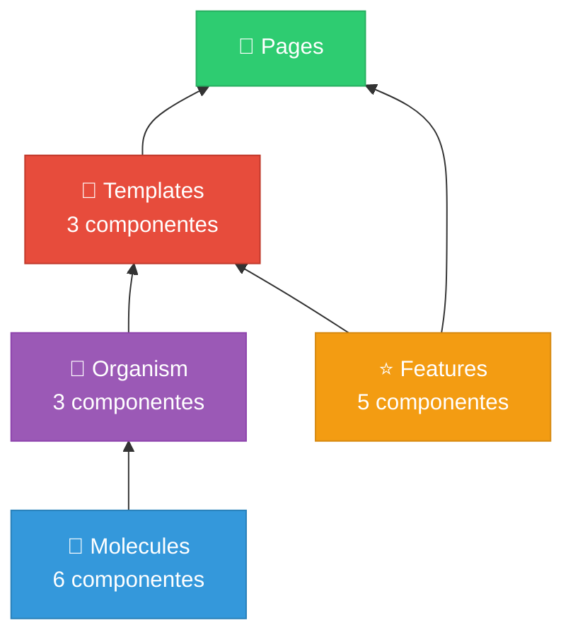
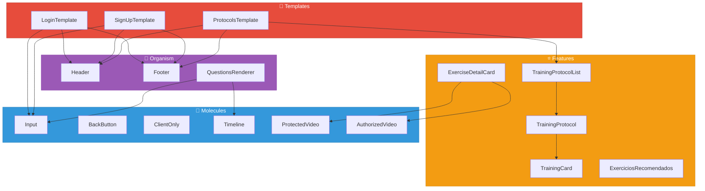
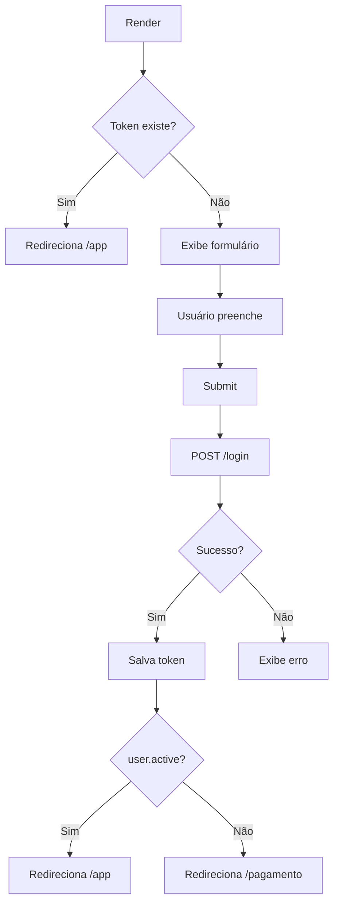
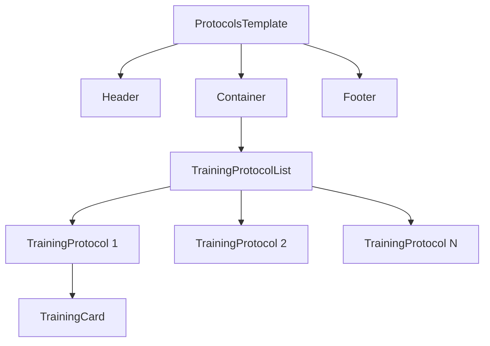
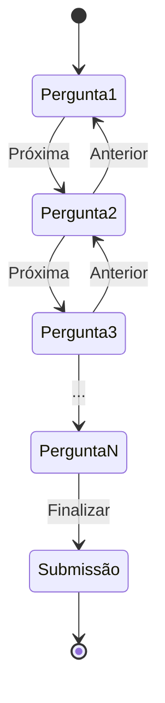
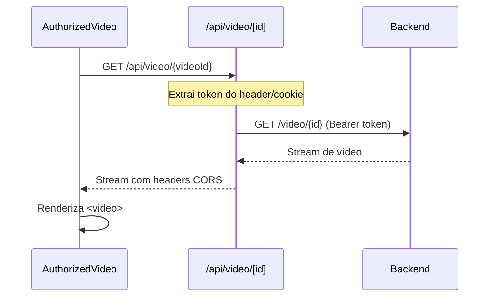
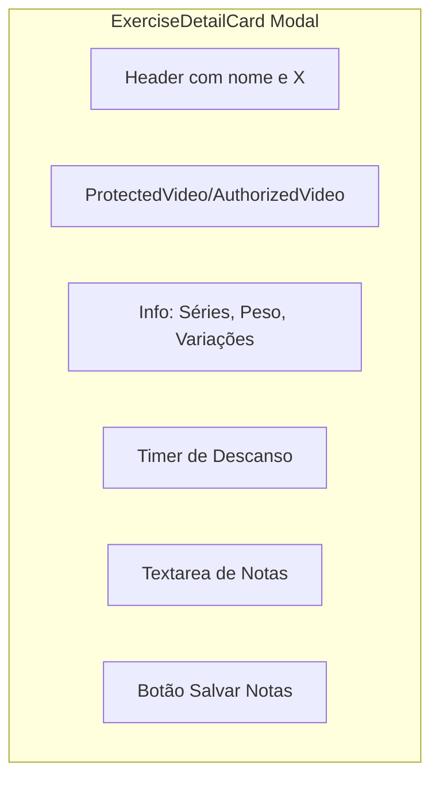
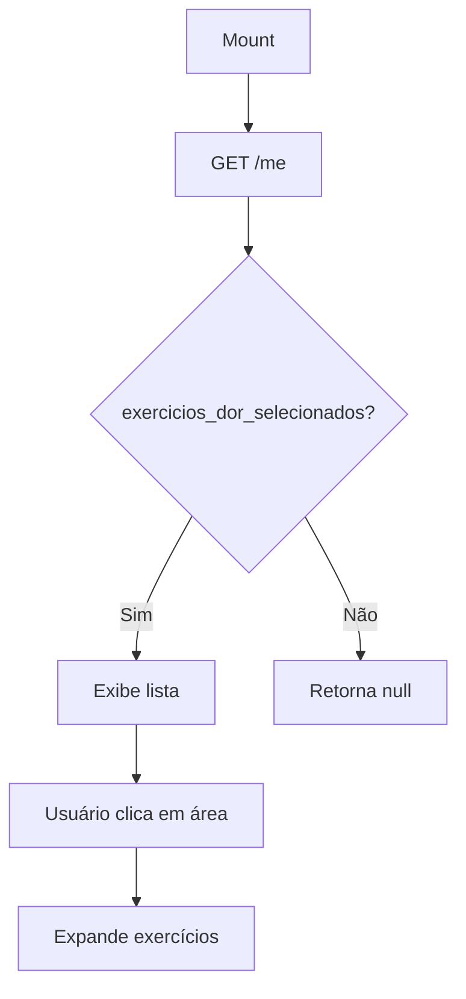
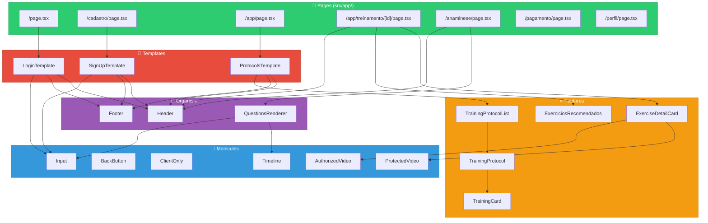
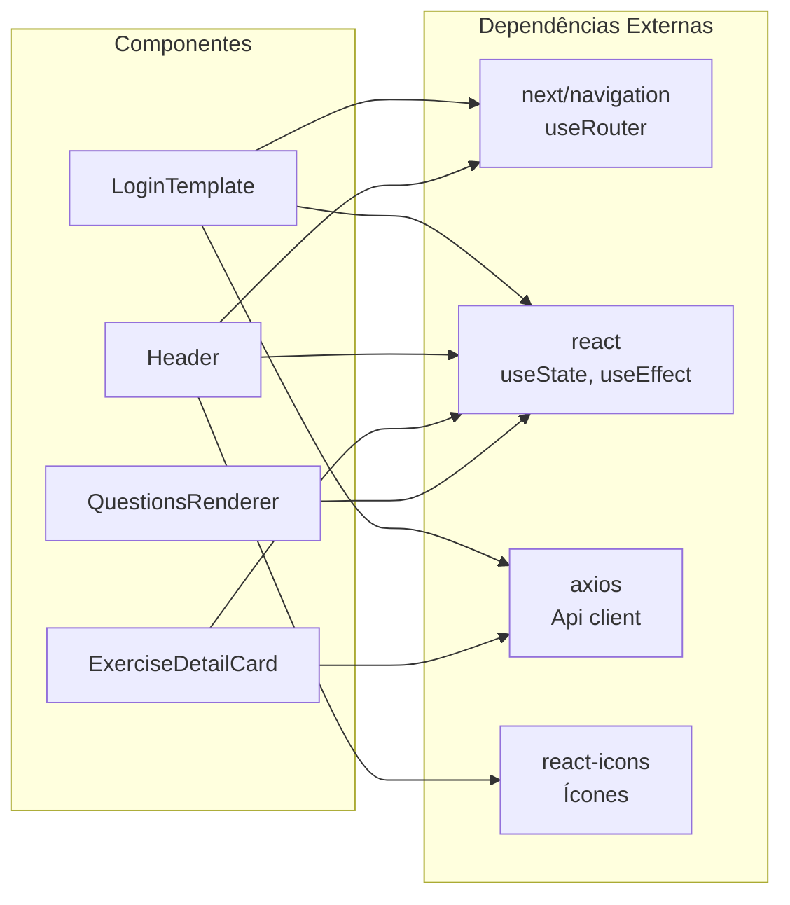

# 🧩 Componentes - Personal-Fit Frontend

> **Versão:** 1.0.0  
> **Última atualização:** 23 de Dezembro de 2025  
> **Padrão:** Atomic Design Adaptado

---

## Índice

1. [Visão Geral](#1-visão-geral)
2. [Hierarquia de Componentes](#2-hierarquia-de-componentes)
3. [Templates](#3-templates)
4. [Organism](#4-organism)
5. [Molecules](#5-molecules)
6. [Features](#6-features)
7. [Diagrama de Relacionamentos](#7-diagrama-de-relacionamentos)
8. [Convenções de Código](#8-convenções-de-código)

---

## 1. Visão Geral

O projeto utiliza **Atomic Design** adaptado para React, organizando componentes em 4 camadas:



### Resumo de Componentes

| Camada        | Quantidade | Diretório                   |
| ------------- | ---------- | --------------------------- |
| **Molecules** | 6          | `src/components/molecules/` |
| **Organism**  | 3          | `src/components/organism/`  |
| **Templates** | 3          | `src/components/templates/` |
| **Features**  | 5          | `src/components/features/`  |

---

## 2. Hierarquia de Componentes



---

## 3. Templates

### 3.1 LoginTemplate

**Arquivo:** `src/components/templates/Login/index.tsx`

**Propósito:** Template do formulário de login com autenticação JWT.

```typescript
'use client';

interface LoginTemplateProps {
    // Não recebe props externas
}

export default function LoginTemplate(): JSX.Element;
```

**Estado Interno:**

| Estado     | Tipo      | Descrição              |
| ---------- | --------- | ---------------------- |
| `email`    | `string`  | Email do usuário       |
| `password` | `string`  | Senha do usuário       |
| `error`    | `string`  | Mensagem de erro       |
| `loading`  | `boolean` | Estado de carregamento |

**Funções:**

| Função              | Parâmetros     | Retorno         | Descrição                         |
| ------------------- | -------------- | --------------- | --------------------------------- |
| `handleSubmit`      | `e: FormEvent` | `Promise<void>` | Processa login via API            |
| `checkExistingAuth` | -              | `void`          | Verifica token existente no mount |

**Fluxo:**



**Dependências:**

- `Header` (organism)
- `Input` (molecule)
- `Api` (utils)
- `useRouter` (next/navigation)

---

### 3.2 SignUpTemplate

**Arquivo:** `src/components/templates/SignUp/index.tsx`

**Propósito:** Template do formulário de cadastro de novos usuários.

```typescript
'use client';

interface SignUpTemplateProps {
    // Não recebe props externas
}

export default function SignUpTemplate(): JSX.Element;
```

**Estado Interno:**

| Estado            | Tipo      | Descrição              |
| ----------------- | --------- | ---------------------- |
| `name`            | `string`  | Nome completo          |
| `email`           | `string`  | Email                  |
| `password`        | `string`  | Senha                  |
| `confirmPassword` | `string`  | Confirmação de senha   |
| `cpf`             | `string`  | CPF (formatado)        |
| `phone`           | `string`  | Telefone fixo          |
| `mobilePhone`     | `string`  | Celular                |
| `error`           | `string`  | Mensagem de erro       |
| `loading`         | `boolean` | Estado de carregamento |

**Funções:**

| Função         | Parâmetros      | Retorno         | Descrição                    |
| -------------- | --------------- | --------------- | ---------------------------- |
| `handleSubmit` | `e: FormEvent`  | `Promise<void>` | Processa registro            |
| `formatCPF`    | `value: string` | `string`        | Formata CPF (000.000.000-00) |
| `formatPhone`  | `value: string` | `string`        | Formata telefone             |
| `cleanForAPI`  | `value: string` | `string`        | Remove formatação            |

**Validações:**

- Senha mínima: 6 caracteres
- Senhas devem coincidir
- CPF: 11 dígitos
- Email: formato válido

**Dependências:**

- `Header` (organism)
- `Input` (molecule)
- `Api` (utils)

---

### 3.3 ProtocolsTemplate

**Arquivo:** `src/components/templates/Protocols/index.tsx`

**Propósito:** Template que exibe a lista de protocolos de treino do usuário.

```typescript
'use client';

interface ProtocolsTemplateProps {
    protocols: Array<{
        id: string;
        reference: string;
        trainings: TrainingCardProps[];
    }>;
}

export default function ProtocolsTemplate({
    protocols,
}: ProtocolsTemplateProps): JSX.Element;
```

**Props:**

| Prop        | Tipo              | Obrigatório | Descrição           |
| ----------- | ----------------- | ----------- | ------------------- |
| `protocols` | `Array<Protocol>` | Sim         | Lista de protocolos |

**Estrutura do Protocol:**

```typescript
interface Protocol {
    id: string;
    reference: string; // Ex: "Protocolo A", "Protocolo B"
    trainings: TrainingCardProps[];
}
```

**Renderização:**



**Dependências:**

- `Header` (organism)
- `Footer` (organism)
- `TrainingProtocolList` (feature)

---

## 4. Organism

### 4.1 Header

**Arquivo:** `src/components/organism/Header/index.tsx`

**Propósito:** Cabeçalho de navegação com logo, nome do usuário e menu.

```typescript
'use client';

interface HeaderProps {
    userName?: string;
    showMenu?: boolean;
    showBackButton?: boolean;
    onBackClick?: () => void;
}

export default function Header(props: HeaderProps): JSX.Element;
```

**Props:**

| Prop             | Tipo         | Padrão      | Descrição                |
| ---------------- | ------------ | ----------- | ------------------------ |
| `userName`       | `string`     | `undefined` | Nome exibido no header   |
| `showMenu`       | `boolean`    | `true`      | Exibe menu hamburguer    |
| `showBackButton` | `boolean`    | `false`     | Exibe botão voltar       |
| `onBackClick`    | `() => void` | `undefined` | Callback do botão voltar |

**Estado Interno:**

| Estado     | Tipo            | Descrição               |
| ---------- | --------------- | ----------------------- |
| `menuOpen` | `boolean`       | Controle do menu mobile |
| `user`     | `IUser \| null` | Dados do usuário logado |

**Funções:**

| Função          | Descrição                               |
| --------------- | --------------------------------------- |
| `toggleMenu`    | Abre/fecha menu mobile                  |
| `handleLogout`  | Limpa localStorage e redireciona para / |
| `handleProfile` | Navega para /perfil                     |

**Menu Items:**

- Perfil → `/perfil`
- Meus Treinos → `/app`
- Sair → Logout

**CSS:** `Header/styles.css`

---

### 4.2 Footer

**Arquivo:** `src/components/organism/Footer/index.tsx`

**Propósito:** Rodapé com informações de contato e links sociais.

```typescript
export default function Footer(): JSX.Element;
```

**Conteúdo:**

- Copyright © 2024 Team D'Bomfim
- Links de redes sociais (Instagram, WhatsApp)
- Informações de contato

**CSS:** `Footer/Footer.module.css`

---

### 4.3 QuestionsRenderer

**Arquivo:** `src/components/organism/QuestionsRenderer/index.tsx`

**Propósito:** Renderiza questionário de anamnese com navegação entre perguntas.

```typescript
'use client';

interface QuestionsRendererProps {
    questions: IQuestionProps[];
    submitQuestions: (answers: Record<string, string>) => void;
}

export default function QuestionsRenderer({
    questions,
    submitQuestions,
}: QuestionsRendererProps): JSX.Element;
```

**Props:**

| Prop              | Tipo                | Descrição             |
| ----------------- | ------------------- | --------------------- |
| `questions`       | `IQuestionProps[]`  | Array de perguntas    |
| `submitQuestions` | `(answers) => void` | Callback de submissão |

**Interface IQuestionProps:**

```typescript
interface IQuestionProps {
    id: string;
    text: string;
    options: Array<{
        question_id: string;
        answer_id: string;
        text: string;
    }>;
}
```

**Estado Interno:**

| Estado         | Tipo                     | Descrição                |
| -------------- | ------------------------ | ------------------------ |
| `currentIndex` | `number`                 | Índice da pergunta atual |
| `answers`      | `Record<string, string>` | Respostas selecionadas   |

**Funções:**

| Função         | Descrição                              |
| -------------- | -------------------------------------- |
| `handleSelect` | Seleciona resposta para pergunta atual |
| `handleNext`   | Avança para próxima pergunta           |
| `handlePrev`   | Volta para pergunta anterior           |
| `handleSubmit` | Envia todas as respostas               |

**Fluxo de Navegação:**



**Dependências:**

- `Timeline` (molecule)

---

## 5. Molecules

### 5.1 Input

**Arquivo:** `src/components/molecules/Input/index.tsx`

**Propósito:** Componente de input estilizado e reutilizável.

```typescript
interface IInputProps extends InputHTMLAttributes<HTMLInputElement> {
    // Herda todos os atributos HTML de input
}

export default function Input(props: IInputProps): JSX.Element;
```

**Props:** Todas as props nativas de `<input>` HTML.

**Exemplo de Uso:**

```tsx
<Input
    type="email"
    placeholder="Digite seu email"
    value={email}
    onChange={(e) => setEmail(e.target.value)}
    required
/>
```

---

### 5.2 BackButton

**Arquivo:** `src/components/molecules/BackButton/index.tsx`

**Propósito:** Botão de navegação "voltar" com ícone e label.

```typescript
interface IBackButtonProps {
    onClick: () => void;
    link: string;
    label: string;
}

export default function BackButton({
    onClick,
    link,
    label,
}: IBackButtonProps): JSX.Element;
```

**Props:**

| Prop      | Tipo         | Descrição                  |
| --------- | ------------ | -------------------------- |
| `onClick` | `() => void` | Callback ao clicar         |
| `link`    | `string`     | URL de destino (para Link) |
| `label`   | `string`     | Texto exibido              |

**Exemplo:**

```tsx
<BackButton
    onClick={() => router.back()}
    link="/app"
    label="Voltar aos treinos"
/>
```

---

### 5.3 ClientOnly

**Arquivo:** `src/components/molecules/ClientOnly/index.tsx`

**Propósito:** Wrapper que renderiza children apenas no cliente (evita erros de hidratação SSR).

```typescript
interface ClientOnlyProps {
    children: ReactNode;
    fallback?: ReactNode;
}

export default function ClientOnly({
    children,
    fallback = null,
}: ClientOnlyProps): JSX.Element | null;
```

**Props:**

| Prop       | Tipo        | Padrão | Descrição            |
| ---------- | ----------- | ------ | -------------------- |
| `children` | `ReactNode` | -      | Conteúdo client-side |
| `fallback` | `ReactNode` | `null` | UI durante SSR       |

**Implementação:**

```typescript
export default function ClientOnly({
    children,
    fallback = null,
}: ClientOnlyProps) {
    const [mounted, setMounted] = useState(false);

    useEffect(() => {
        setMounted(true);
    }, []);

    if (!mounted) return fallback;
    return children;
}
```

**Uso Comum:**

```tsx
<ClientOnly fallback={<Spinner />}>
    <ComponenteQueUsaLocalStorage />
</ClientOnly>
```

---

### 5.4 Timeline

**Arquivo:** `src/components/molecules/Timeline/index.tsx`

**Propósito:** Indicador visual de progresso para questionários multi-step.

```typescript
interface TimelineProps {
    total: number;
    current: number;
}

export default function Timeline({
    total,
    current,
}: TimelineProps): JSX.Element;
```

**Props:**

| Prop      | Tipo     | Descrição              |
| --------- | -------- | ---------------------- |
| `total`   | `number` | Total de steps         |
| `current` | `number` | Step atual (0-indexed) |

**Renderização Visual:**

```
[●]──[●]──[○]──[○]──[○]
 1    2    3    4    5
      ↑
   current=1
```

---

### 5.5 ProtectedVideo

**Arquivo:** `src/components/molecules/ProtectedVideo/index.tsx`

**Propósito:** Exibe GIF ou vídeo do backend com tratamento de erros.

```typescript
interface ProtectedVideoProps {
    src: string;
    alt: string;
    className?: string;
}

export default function ProtectedVideo({
    src,
    alt,
    className,
}: ProtectedVideoProps): JSX.Element;
```

**Props:**

| Prop        | Tipo     | Obrigatório | Descrição                              |
| ----------- | -------- | ----------- | -------------------------------------- |
| `src`       | `string` | Sim         | Path do arquivo (relativo ou absoluto) |
| `alt`       | `string` | Sim         | Texto alternativo                      |
| `className` | `string` | Não         | Classes CSS adicionais                 |

**Lógica de URL:**

```typescript
const API_BASE = process.env.NEXT_PUBLIC_API_URL;

function buildUrl(src: string): string {
    // Se já é URL completa, retorna
    if (src.startsWith('http')) return src;

    // Normaliza caminhos
    // "static/gifs/nome.gif" → `${API_BASE}/static/gifs/nome.gif`
    // "gifs/nome.gif"        → `${API_BASE}/static/gifs/nome.gif`
    // "nome.gif"             → `${API_BASE}/static/gifs/nome.gif`

    const cleanPath = src.replace(/^(static\/)?gifs\//, '');
    return `${API_BASE}/static/gifs/${cleanPath}`;
}
```

**Estado:**

| Estado    | Tipo      | Descrição                        |
| --------- | --------- | -------------------------------- |
| `error`   | `boolean` | Indica falha no carregamento     |
| `loading` | `boolean` | Indica carregamento em progresso |

**Detecção de Tipo:**

```typescript
const isGif = src.toLowerCase().endsWith('.gif');
// GIF → 
// Outros → <video>
```

---

### 5.6 AuthorizedVideo

**Arquivo:** `src/components/molecules/AuthorizedVideo/index.tsx`

**Propósito:** Carrega vídeo via API Route com autenticação JWT.

```typescript
interface AuthorizedVideoProps {
    videoId: string;
    alt: string;
    className?: string;
    poster?: string;
}

export default function AuthorizedVideo({
    videoId,
    alt,
    className,
    poster,
}: AuthorizedVideoProps): JSX.Element;
```

**Props:**

| Prop        | Tipo     | Obrigatório | Descrição              |
| ----------- | -------- | ----------- | ---------------------- |
| `videoId`   | `string` | Sim         | ID do vídeo no backend |
| `alt`       | `string` | Sim         | Texto alternativo      |
| `className` | `string` | Não         | Classes CSS            |
| `poster`    | `string` | Não         | Imagem de preview      |

**Fluxo de Carregamento:**



**CSS:** `AuthorizedVideo/AuthorizedVideo.module.css`

---

## 6. Features

### 6.1 ExerciseDetailCard

**Arquivo:** `src/components/features/ExerciseDetailCard.tsx`

**Propósito:** Modal de detalhes do exercício com vídeo, timer e anotações.

```typescript
'use client';

interface ExerciseDetailCardProps {
    exercise: ExerciseLog;
    onClose: () => void;
    trainingId: string;
}

export default function ExerciseDetailCard({
    exercise,
    onClose,
    trainingId,
}: ExerciseDetailCardProps): JSX.Element;
```

**Props:**

| Prop         | Tipo          | Descrição                        |
| ------------ | ------------- | -------------------------------- |
| `exercise`   | `ExerciseLog` | Dados do exercício               |
| `onClose`    | `() => void`  | Callback para fechar modal       |
| `trainingId` | `string`      | ID do treino (para salvar notas) |

**Estado Interno:**

| Estado         | Tipo      | Descrição                     |
| -------------- | --------- | ----------------------------- |
| `timerSeconds` | `number`  | Segundos do timer de descanso |
| `timerActive`  | `boolean` | Timer está rodando            |
| `notes`        | `string`  | Anotações do usuário          |
| `notesSaved`   | `boolean` | Indica se notas foram salvas  |
| `saving`       | `boolean` | Salvando notas                |

**Funções:**

| Função            | Parâmetros | Descrição                     |
| ----------------- | ---------- | ----------------------------- |
| `startTimer`      | -          | Inicia timer de descanso      |
| `pauseTimer`      | -          | Pausa timer                   |
| `resetTimer`      | -          | Reseta para tempo de descanso |
| `handleSaveNotes` | -          | Salva notas via API           |

**Interface ExerciseLog:**

```typescript
interface ExerciseLog {
    id: string;
    name: string;
    series: number[]; // [10, 12, 15] → "10 / 12 / 15"
    variations: string;
    video_url: string;
    video_thumb: string;
    timed: boolean;
    weight: number;
    notes?: string;
    restTime: number; // Tempo de descanso em segundos
}
```

**Layout:**



**CSS:** `ExerciseDetailCard.module.css`

---

### 6.2 TrainingCard

**Arquivo:** `src/components/features/TrainingCard.tsx`

**Propósito:** Card clicável representando um treino dentro de um protocolo.

```typescript
interface TrainingCardProps {
    id: string;
    label: string;
}

export default function TrainingCard({
    id,
    label,
}: TrainingCardProps): JSX.Element;
```

**Props:**

| Prop    | Tipo     | Descrição                     |
| ------- | -------- | ----------------------------- |
| `id`    | `string` | ID único do treino            |
| `label` | `string` | Nome exibido (ex: "Treino A") |

**Comportamento:**

- Clique navega para `/app/treinamento/{id}`
- Exibe ícone de treino
- Hover com efeito visual

**CSS:** `TrainingCard.module.css`

---

### 6.3 TrainingProtocol

**Arquivo:** `src/components/features/TrainingProtocol.tsx`

**Propósito:** Agrupa cards de treino sob um protocolo específico.

```typescript
interface TrainingProtocolProps {
    protocolId: string;
    protocolNumber: number;
    trainings: TrainingCardProps[];
}

export default function TrainingProtocol({
    protocolId,
    protocolNumber,
    trainings,
}: TrainingProtocolProps): JSX.Element;
```

**Props:**

| Prop             | Tipo                  | Descrição            |
| ---------------- | --------------------- | -------------------- |
| `protocolId`     | `string`              | ID do protocolo      |
| `protocolNumber` | `number`              | Número para exibição |
| `trainings`      | `TrainingCardProps[]` | Lista de treinos     |

**Renderização:**

```
┌─────────────────────────────────┐
│ Protocolo 1                     │
├─────────────────────────────────┤
│ ┌─────────┐ ┌─────────┐         │
│ │Treino A │ │Treino B │ ...     │
│ └─────────┘ └─────────┘         │
└─────────────────────────────────┘
```

**CSS:** `TrainingProtocol.module.css`

---

### 6.4 TrainingProtocolList

**Arquivo:** `src/components/features/TrainingProtocolList.tsx`

**Propósito:** Lista todos os protocolos do usuário.

```typescript
interface TrainingProtocolListProps {
    protocolId: string;
    protocolNumber: number;
    trainings: TrainingCardProps[];
}

export default function TrainingProtocolList(
    props: TrainingProtocolListProps,
): JSX.Element;
```

**Uso:**

```tsx
{
    protocols.map((protocol, index) => (
        <TrainingProtocolList
            key={protocol.id}
            protocolId={protocol.id}
            protocolNumber={index + 1}
            trainings={protocol.trainings}
        />
    ));
}
```

**CSS:** `TrainingProtocolList.module.css`

---

### 6.5 ExerciciosRecomendados

**Arquivo:** `src/components/features/ExerciciosRecomendados.tsx`

**Propósito:** Busca e exibe exercícios recomendados baseados nas áreas de dor selecionadas na anamnese.

```typescript
'use client';

export default function ExerciciosRecomendados(): JSX.Element | null;
```

**Estado:**

| Estado        | Tipo              | Descrição                           |
| ------------- | ----------------- | ----------------------------------- |
| `exercicios`  | `ExerciciosDor[]` | Lista de exercícios por área de dor |
| `loading`     | `boolean`         | Carregando dados                    |
| `expandedDor` | `string \| null`  | Área de dor expandida               |

**Fluxo de Dados:**



**Interface ExerciciosDor:**

```typescript
interface ExerciciosDor {
    id?: string;
    dor: string; // Ex: "Dor no joelho"
    nome?: string;
    descricao?: string;
    video_url?: string;
    exercicios?: ExercicioIndividual[];
}

interface ExercicioIndividual {
    id?: string;
    nome: string;
    descricao?: string;
    video_url?: string;
}
```

---

## 7. Diagrama de Relacionamentos

### 7.1 Fluxo de Importações



### 7.2 Dependências Externas



---

## 8. Convenções de Código

### 8.1 Estrutura de Arquivo

```typescript
// 1. 'use client' se necessário (SEMPRE primeiro)
'use client';

// 2. Imports externos
import React, { useState, useEffect } from 'react';
import { useRouter } from 'next/navigation';

// 3. Imports internos (alias @/)
import { Api } from '@/app/utils/api';
import { Header } from '@/components/organism/Header';

// 4. Imports de tipos
import type { ExerciseLog } from './types';

// 5. Imports de estilos
import styles from './Component.module.css';

// 6. Interfaces/Types locais
interface ComponentProps {
  id: string;
  onAction: (data: string) => void;
}

// 7. Componente
export default function Component({ id, onAction }: ComponentProps) {
  // 7.1 Hooks de estado
  const [state, setState] = useState('');

  // 7.2 Hooks de navegação/contexto
  const router = useRouter();

  // 7.3 Effects
  useEffect(() => {
    // Lógica
  }, [id]);

  // 7.4 Handlers
  const handleClick = () => {
    onAction(state);
  };

  // 7.5 Render
  return (
    <div className={styles.container}>
      {/* JSX */}
    </div>
  );
}
```

### 8.2 Nomenclatura

| Tipo                | Convenção          | Exemplo                 |
| ------------------- | ------------------ | ----------------------- |
| Componentes         | PascalCase         | `TrainingCard`          |
| Props interface     | IPascalCaseProps   | `ITrainingCardProps`    |
| Funções handler     | handle + Ação      | `handleSubmit`          |
| Estado booleano     | is/has + Descrição | `isLoading`, `hasError` |
| CSS Modules         | camelCase          | `styles.cardContainer`  |
| Arquivos componente | index.tsx          | `Button/index.tsx`      |
| Arquivos de tipo    | interface.ts       | `Button/interface.ts`   |

### 8.3 CSS Modules

```css
/* Component.module.css */

/* Container principal */
.container {
    /* ... */
}

/* Modificadores */
.containerActive {
    /* ... */
}

/* Elementos filhos */
.header {
    /* ... */
}

.content {
    /* ... */
}

/* Estados */
.loading {
    /* ... */
}

.error {
    /* ... */
}
```

### 8.4 Tratamento de Erros

```typescript
// ✅ CORRETO
try {
    setLoading(true);
    const { data } = await Api.post('/endpoint', payload);
    setSuccess(true);
} catch (error) {
    console.error('[ComponentName] Erro:', error);
    setError(error instanceof Error ? error.message : 'Erro desconhecido');
} finally {
    setLoading(false);
}

// ❌ INCORRETO
const data = await Api.post('/endpoint', payload); // Sem try-catch
```

---

## Referências Cruzadas

- **Arquitetura geral:** [01-ARCHITECTURE.md](01-ARCHITECTURE.md)
- **Páginas e rotas:** [03-PAGES-ROUTES.md](03-PAGES-ROUTES.md)
- **Integração com API:** [04-API-INTEGRATION.md](04-API-INTEGRATION.md)
- **Tipos e interfaces:** [05-TYPES-INTERFACES.md](05-TYPES-INTERFACES.md)
- **Hooks e utilitários:** [06-HOOKS-UTILITIES.md](06-HOOKS-UTILITIES.md)
- **Segurança e deploy:** [07-SECURITY-DEPLOY.md](07-SECURITY-DEPLOY.md)

---

> **Próximo:** [03-PAGES-ROUTES.md](03-PAGES-ROUTES.md) - Documentação de todas as páginas e rotas
