# 🗺️ Páginas e Rotas - Personal-Fit Frontend

> **Versão:** 1.0.0  
> **Última atualização:** 23 de Dezembro de 2025  
> **Framework:** Next.js 15+ App Router

---

## Índice

1. [Visão Geral do Sistema de Rotas](#1-visão-geral-do-sistema-de-rotas)
2. [Mapa de Rotas](#2-mapa-de-rotas)
3. [Páginas Públicas](#3-páginas-públicas)
4. [Páginas Protegidas](#4-páginas-protegidas)
5. [API Routes](#5-api-routes)
6. [Fluxos de Navegação](#6-fluxos-de-navegação)
7. [Layout e Metadados](#7-layout-e-metadados)
8. [Guards e Redirecionamentos](#8-guards-e-redirecionamentos)

---

## 1. Visão Geral do Sistema de Rotas

O projeto utiliza o **App Router** do Next.js 15, onde cada pasta em `src/app/` representa uma rota.

### Convenções de Arquivo

| Arquivo         | Propósito                             |
| --------------- | ------------------------------------- |
| `page.tsx`      | Página renderizável (define a rota)   |
| `layout.tsx`    | Layout wrapper para páginas aninhadas |
| `route.ts`      | API Route handler (GET, POST, etc.)   |
| `loading.tsx`   | UI de loading (Suspense boundary)     |
| `error.tsx`     | Error boundary                        |
| `not-found.tsx` | Página 404 personalizada              |
| `[param]/`      | Rota dinâmica                         |

### Estrutura de Rotas

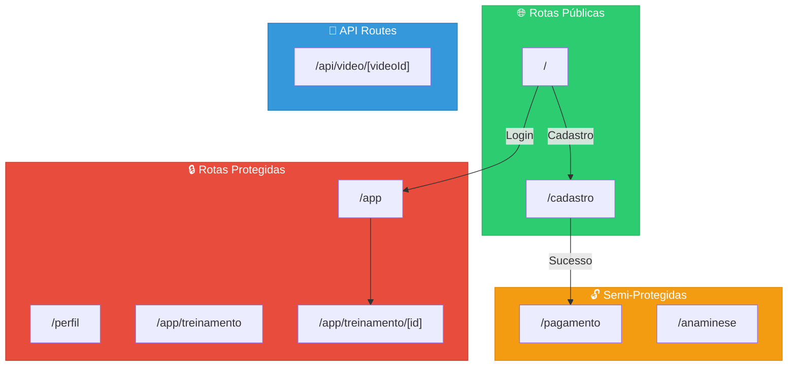

---

## 2. Mapa de Rotas

### 2.1 Tabela Completa de Rotas

| Rota                    | Arquivo                             | Tipo   | Auth | Descrição             |
| ----------------------- | ----------------------------------- | ------ | ---- | --------------------- |
| `/`                     | `app/page.tsx`                      | Página | ❌   | Login                 |
| `/cadastro`             | `app/cadastro/page.tsx`             | Página | ❌   | Registro de usuário   |
| `/pagamento`            | `app/pagamento/page.tsx`            | Página | ⚠️   | Assinatura de plano   |
| `/anaminese`            | `app/anaminese/page.tsx`            | Página | ⚠️   | Questionário de saúde |
| `/perfil`               | `app/perfil/page.tsx`               | Página | ✅   | Perfil do usuário     |
| `/app`                  | `app/app/page.tsx`                  | Página | ✅   | Lista de protocolos   |
| `/app/treinamento`      | `app/app/treinamento/page.tsx`      | Página | ✅   | Redirecionamento      |
| `/app/treinamento/[id]` | `app/app/treinamento/[id]/page.tsx` | Página | ✅   | Detalhes do treino    |
| `/api/video/[videoId]`  | `app/api/video/[videoId]/route.ts`  | API    | ✅   | Proxy de vídeo        |

**Legenda:**

- ❌ Não requer autenticação
- ⚠️ Requer token mas permite acesso inicial
- ✅ Requer autenticação completa

### 2.2 Hierarquia de Pastas

```
src/app/
├── layout.tsx                 # Layout raiz
├── page.tsx                   # / (Login)
│
├── cadastro/
│   └── page.tsx              # /cadastro
│
├── pagamento/
│   ├── page.tsx              # /pagamento
│   ├── interface.ts          # Tipos
│   ├── styles.css            # Estilos
│   └── paymentTypes/
│       ├── CreditCard.tsx    # Componente cartão
│       └── pix.tsx           # Componente PIX
│
├── anaminese/
│   └── page.tsx              # /anaminese
│
├── perfil/
│   ├── page.tsx              # /perfil
│   └── styles.css            # Estilos
│
├── app/
│   ├── page.tsx              # /app (protocolos)
│   └── treinamento/
│       ├── page.tsx          # /app/treinamento (redirect)
│       └── [id]/
│           ├── page.tsx      # /app/treinamento/:id
│           └── TrainingPage.module.css
│
├── api/
│   └── video/
│       └── [videoId]/
│           └── route.ts      # API proxy
│
├── css/
│   ├── globals.css           # Estilos globais
│   └── constants.css         # Variáveis CSS
│
└── utils/
    └── api.ts                # Cliente HTTP
```

---

## 3. Páginas Públicas

### 3.1 Página de Login (/)

**Arquivo:** `src/app/page.tsx`

```typescript
'use client';

export default function LoginPage(): JSX.Element;
```

**Funcionalidades:**

- Formulário de email/senha
- Validação de campos
- Autenticação via JWT
- Redirecionamento baseado em `user.active`

**Fluxo:**

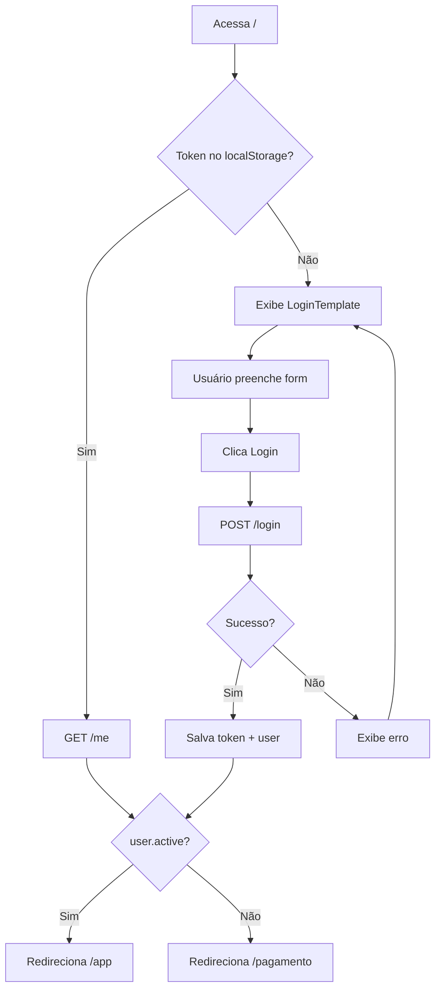

**Estado:**

| Estado     | Tipo      | Descrição              |
| ---------- | --------- | ---------------------- |
| `email`    | `string`  | Campo de email         |
| `password` | `string`  | Campo de senha         |
| `error`    | `string`  | Mensagem de erro       |
| `loading`  | `boolean` | Estado de carregamento |

**Redirecionamentos:**

| Condição                    | Destino          |
| --------------------------- | ---------------- |
| Token válido + user.active  | `/app`           |
| Token válido + !user.active | `/pagamento`     |
| Sem token                   | Permanece em `/` |

---

### 3.2 Página de Cadastro (/cadastro)

**Arquivo:** `src/app/cadastro/page.tsx`

```typescript
'use client';

export default function CadastroPage(): JSX.Element;
```

**Funcionalidades:**

- Formulário completo de registro
- Validação de CPF, email, telefone
- Formatação automática de campos
- Confirmação de senha

**Campos do Formulário:**

| Campo             | Tipo     | Validação        | Formatação      |
| ----------------- | -------- | ---------------- | --------------- |
| `name`            | text     | Obrigatório      | -               |
| `email`           | email    | Formato email    | -               |
| `password`        | password | Min 6 caracteres | -               |
| `confirmPassword` | password | Igual a password | -               |
| `cpf`             | text     | 11 dígitos       | 000.000.000-00  |
| `phone`           | tel      | 10 dígitos       | (00) 0000-0000  |
| `mobilePhone`     | tel      | 11 dígitos       | (00) 00000-0000 |

**Fluxo de Registro:**

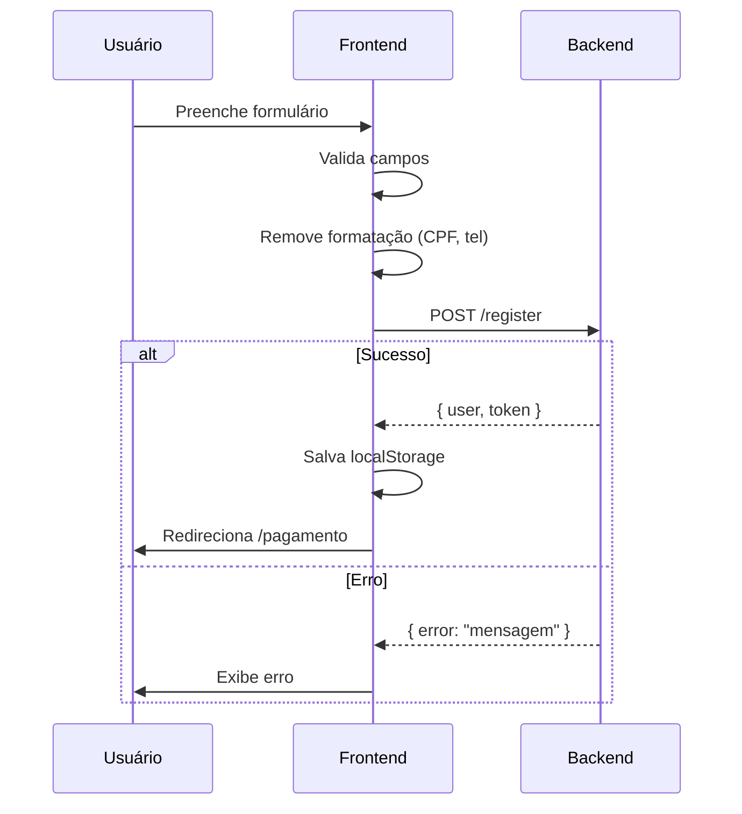

**Payload Enviado:**

```typescript
{
  name: "João Silva",
  email: "joao@email.com",
  password: "senha123",
  cpf: "12345678900",        // Sem formatação
  phone: "1133334444",       // Sem formatação
  mobile_phone: "11999998888" // Sem formatação
}
```

---

## 4. Páginas Protegidas

### 4.1 Página de Pagamento (/pagamento)

**Arquivo:** `src/app/pagamento/page.tsx`

```typescript
'use client';

export default function PagamentoPage(): JSX.Element;
```

**Funcionalidades:**

- Seleção de plano de assinatura
- Formulário de cartão de crédito
- Dados do titular
- Polling de status de pagamento

**Planos Disponíveis:**

| Plano     | Valor     | Ciclo        | Desconto |
| --------- | --------- | ------------ | -------- |
| Bimestral | R$ 79,90  | BIMONTHLY    | -        |
| Semestral | R$ 209,90 | SEMIANNUALLY | 12%      |
| Anual     | R$ 379,90 | YEARLY       | 20.8%    |

**Estado:**

| Estado          | Tipo            | Descrição             |
| --------------- | --------------- | --------------------- |
| `selectedPlan`  | `IPlan \| null` | Plano selecionado     |
| `paymentMethod` | `TPaymentTypes` | 'CreditCard' ou 'PIX' |
| `cardData`      | `object`        | Dados do cartão       |
| `holderData`    | `object`        | Dados do titular      |
| `loading`       | `boolean`       | Processando           |
| `error`         | `string`        | Mensagem de erro      |

**Componentes de Pagamento:**

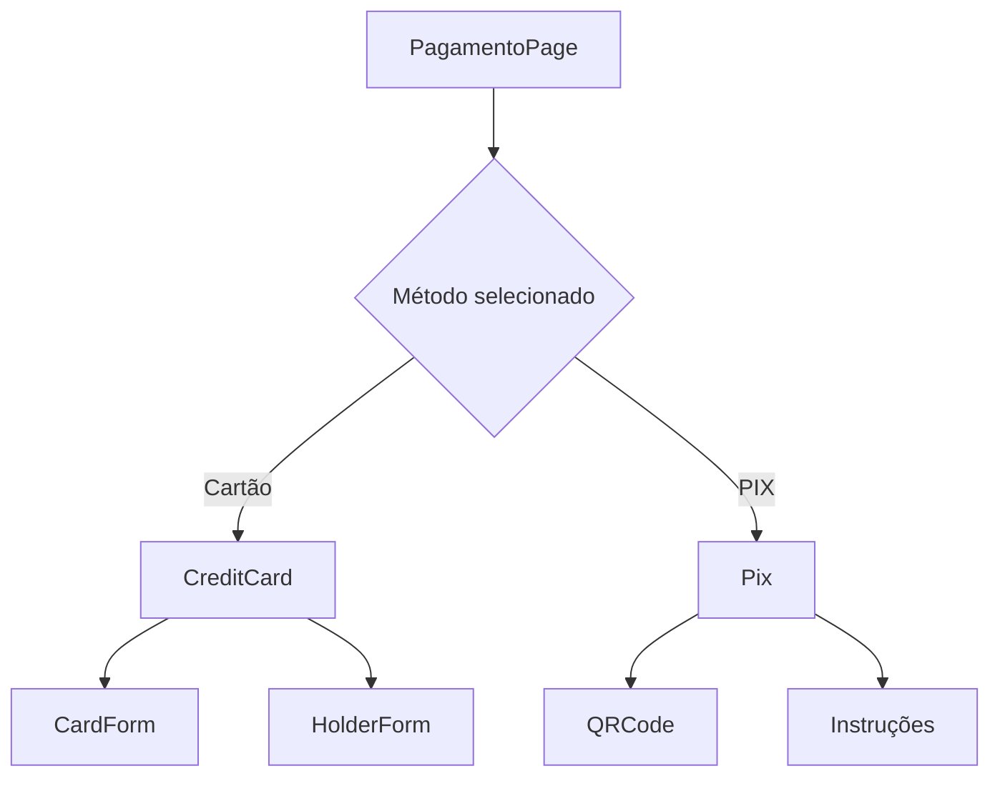

**Fluxo de Pagamento:**

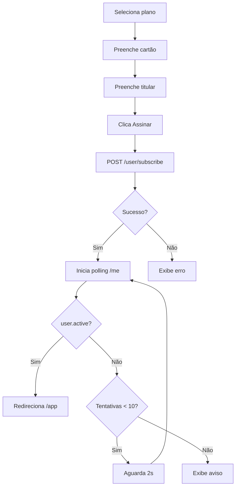

**Arquivos Relacionados:**

- `interface.ts` - Tipos de pagamento
- `styles.css` - Estilos da página
- `paymentTypes/CreditCard.tsx` - Formulário de cartão
- `paymentTypes/pix.tsx` - Opção PIX (parcial)

---

### 4.2 Página de Anamnese (/anaminese)

**Arquivo:** `src/app/anaminese/page.tsx`

```typescript
'use client';

export default function AnamnesePage(): JSX.Element;
```

**Funcionalidades:**

- Carrega perguntas do backend
- Navegação entre perguntas
- Indicador de progresso (Timeline)
- Submissão de respostas

**Fluxo:**

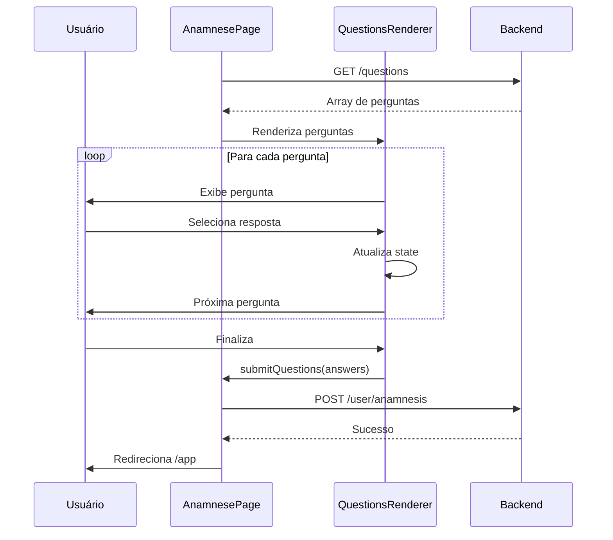

**Estrutura de Resposta:**

```typescript
// Enviado ao backend
{
    answers: [
        { question_id: 'q1', answer_id: 'a1' },
        { question_id: 'q2', answer_id: 'a3' },
        // ...
    ];
}
```

---

### 4.3 Página de Perfil (/perfil)

**Arquivo:** `src/app/perfil/page.tsx`

```typescript
'use client';

export default function PerfilPage(): JSX.Element;
```

**Funcionalidades:**

- Exibe dados do usuário
- Informações de assinatura
- Botão de cancelar assinatura
- Logout

**Dados Exibidos:**

| Campo         | Fonte                    |
| ------------- | ------------------------ |
| Nome          | `user.name`              |
| Email         | `user.email`             |
| CPF           | `user.cpf` (formatado)   |
| Telefone      | `user.phone` (formatado) |
| Status        | `user.active`            |
| Data cadastro | `user.created_at`        |

**Ações:**

| Ação                | Endpoint                 | Resultado                         |
| ------------------- | ------------------------ | --------------------------------- |
| Cancelar assinatura | `DELETE /user/subscribe` | user.active = false               |
| Logout              | -                        | Limpa localStorage, redireciona / |

---

### 4.4 Página de Protocolos (/app)

**Arquivo:** `src/app/app/page.tsx`

```typescript
'use client';

export default function AppPage(): JSX.Element;
```

**Funcionalidades:**

- Lista protocolos do usuário
- Acesso aos treinos de cada protocolo
- Verificação de autenticação

**Estrutura de Dados:**

```typescript
interface Protocol {
    id: string;
    reference: string; // "Protocolo A"
    trainings: Array<{
        id: string;
        label: string; // "Treino A", "Treino B"
    }>;
}
```

**Fluxo de Carregamento:**

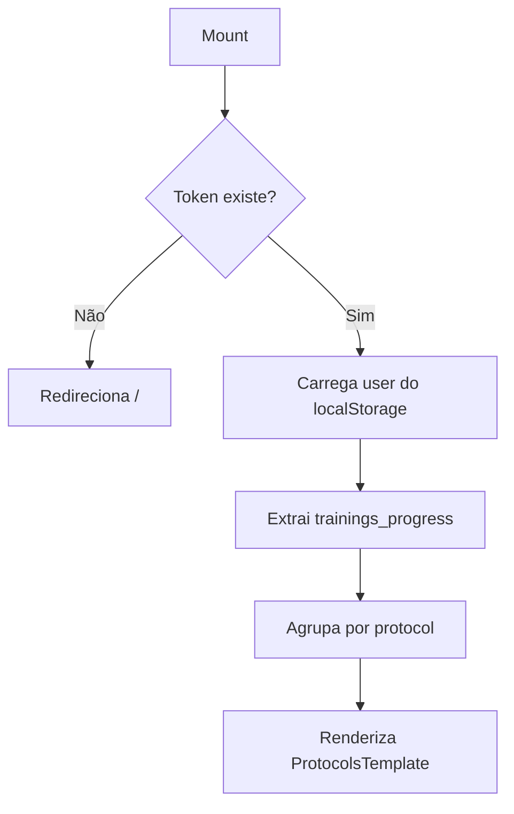

**Renderização:**

```
┌─────────────────────────────────────────┐
│ Header                                  │
├─────────────────────────────────────────┤
│                                         │
│  Protocolo 1                            │
│  ┌─────────┐ ┌─────────┐ ┌─────────┐   │
│  │Treino A │ │Treino B │ │Treino C │   │
│  └─────────┘ └─────────┘ └─────────┘   │
│                                         │
│  Protocolo 2                            │
│  ┌─────────┐ ┌─────────┐               │
│  │Treino A │ │Treino B │               │
│  └─────────┘ └─────────┘               │
│                                         │
├─────────────────────────────────────────┤
│ Footer                                  │
└─────────────────────────────────────────┘
```

---

### 4.5 Página de Treinamento (/app/treinamento/[id])

**Arquivo:** `src/app/app/treinamento/[id]/page.tsx`

```typescript
'use client';

interface TrainingPageProps {
    params: { id: string };
}

export default function TrainingPage({
    params,
}: TrainingPageProps): JSX.Element;
```

**Funcionalidades:**

- Exibe exercícios do treino selecionado
- Modal de detalhes do exercício
- Timer de descanso
- Anotações por exercício
- Exercícios recomendados (baseados em dor)

**Parâmetros de Rota:**

| Parâmetro | Tipo     | Descrição    |
| --------- | -------- | ------------ |
| `id`      | `string` | ID do treino |

**Estado:**

| Estado             | Tipo                  | Descrição           |
| ------------------ | --------------------- | ------------------- |
| `exercises`        | `ExerciseLog[]`       | Lista de exercícios |
| `selectedExercise` | `ExerciseLog \| null` | Exercício no modal  |
| `loading`          | `boolean`             | Carregando dados    |

**Layout da Página:**

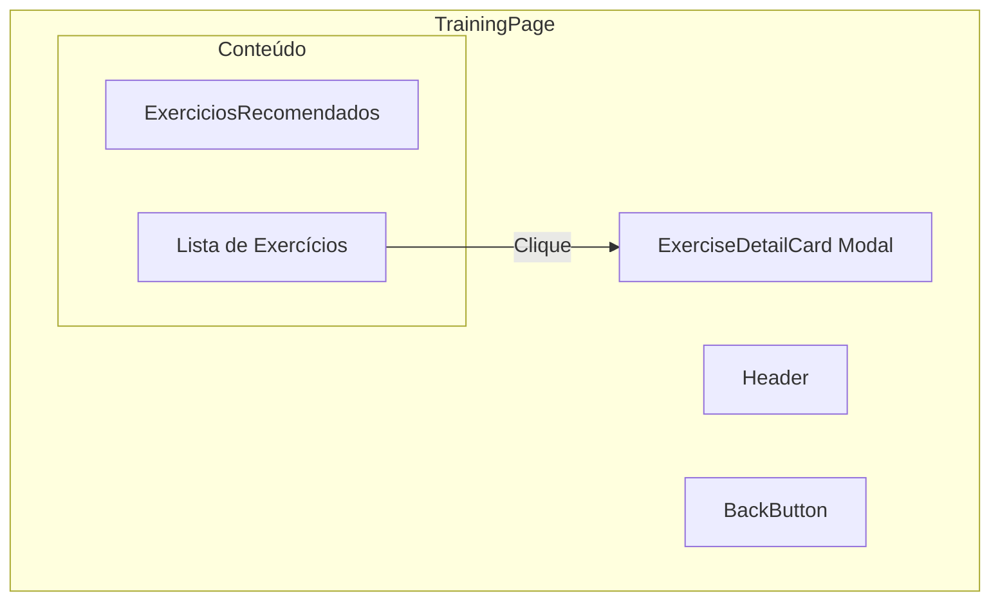

**Fluxo de Carregamento:**

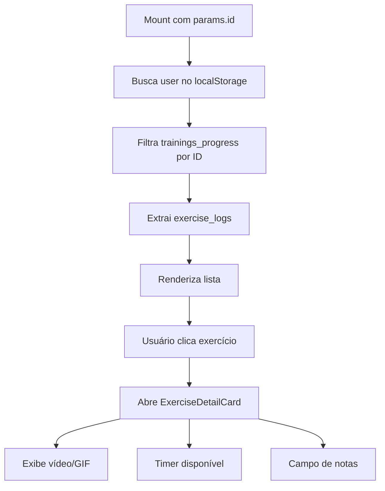

**CSS:** `TrainingPage.module.css`

---

## 5. API Routes

### 5.1 Video Proxy (/api/video/[videoId])

**Arquivo:** `src/app/api/video/[videoId]/route.ts`

```typescript
import { NextRequest, NextResponse } from 'next/server';

export async function GET(
    request: NextRequest,
    { params }: { params: { videoId: string } },
): Promise<NextResponse>;
```

**Propósito:** Proxy autenticado para streaming de vídeos do backend.

**Parâmetros:**

| Parâmetro       | Origem | Descrição   |
| --------------- | ------ | ----------- |
| `videoId`       | URL    | ID do vídeo |
| `Authorization` | Header | Token JWT   |

**Fluxo:**

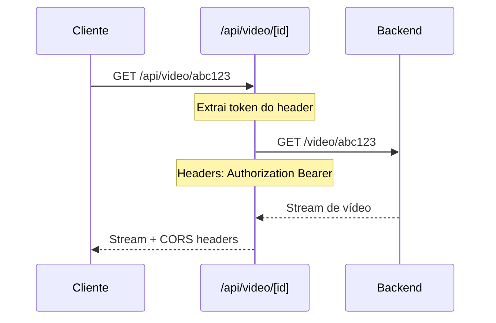

**Headers de Resposta:**

```typescript
{
  'Content-Type': backendContentType,
  'Accept-Ranges': 'bytes',
  'Cache-Control': 'public, max-age=3600',
  'Access-Control-Allow-Origin': '*',
  'Access-Control-Allow-Methods': 'GET, OPTIONS',
  'Access-Control-Allow-Headers': 'Authorization, Content-Type'
}
```

**Tratamento de Erros:**

| Status | Condição             | Resposta                             |
| ------ | -------------------- | ------------------------------------ |
| 401    | Sem token            | `{ error: 'Unauthorized' }`          |
| 404    | Vídeo não encontrado | `{ error: 'Video not found' }`       |
| 500    | Erro no backend      | `{ error: 'Internal server error' }` |

---

## 6. Fluxos de Navegação

### 6.1 Fluxo Completo do Usuário

```mermaid
flowchart TD
    subgraph ONBOARDING["🆕 Onboarding"]
        A[Acessa /] --> B{Tem conta?}
        B -->|Não| C[/cadastro]
        C --> D[Preenche dados]
        D --> E[POST /register]
        E --> F[/pagamento]
        F --> G[Seleciona plano]
        G --> H[Paga]
        H --> I[/anaminese]
        I --> J[Responde perguntas]
        J --> K[POST /anamnesis]
    end

    subgraph AUTH["🔐 Autenticação"]
        B -->|Sim| L[/]
        L --> M[Login]
        M --> N{user.active?}
        N -->|Não| F
    end

    subgraph APP["📱 Aplicação"]
        N -->|Sim| O[/app]
        K --> O
        O --> P[Seleciona protocolo]
        P --> Q[/app/treinamento/id]
        Q --> R[Visualiza exercícios]
        R --> S[Abre detalhes]
        S --> T[Faz anotações]
    end

    subgraph PROFILE["👤 Perfil"]
        O --> U[/perfil]
        U --> V[Cancela assinatura]
        V --> F
        U --> W[Logout]
        W --> A
    end

    style ONBOARDING fill:#2ecc71,stroke:#27ae60,color:#fff
    style AUTH fill:#3498db,stroke:#2980b9,color:#fff
    style APP fill:#f39c12,stroke:#d68910,color:#fff
    style PROFILE fill:#9b59b6,stroke:#8e44ad,color:#fff
```

### 6.2 Fluxo de Login

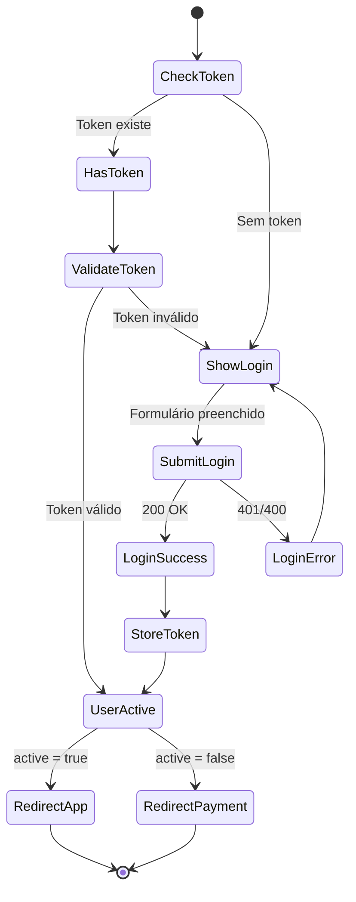

### 6.3 Fluxo de Pagamento

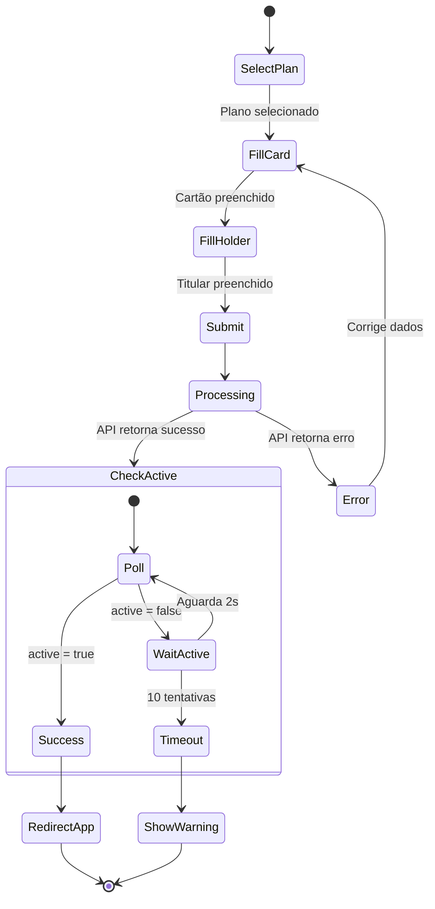

---

## 7. Layout e Metadados

### 7.1 Root Layout

**Arquivo:** `src/app/layout.tsx`

```typescript
import type { Metadata } from 'next';
import './css/globals.css';
import './css/constants.css';
import 'bootstrap/dist/css/bootstrap.min.css';

export const metadata: Metadata = {
  title: "Team D'Bomfim - Personal Fit",
  description: 'Plataforma de treinamento personalizado',
};

export default function RootLayout({
  children,
}: {
  children: React.ReactNode;
}) {
  return (
    <html lang="pt-BR">
      <body>{children}</body>
    </html>
  );
}
```

**Responsabilidades:**

- Importa estilos globais
- Importa Bootstrap CSS
- Define metadados SEO
- Wrapper HTML base

### 7.2 Metadados por Página

| Página       | Title        | Description               |
| ------------ | ------------ | ------------------------- |
| `/`          | Login        | Faça login na plataforma  |
| `/cadastro`  | Cadastro     | Crie sua conta            |
| `/pagamento` | Assinatura   | Escolha seu plano         |
| `/app`       | Meus Treinos | Seus protocolos de treino |

---

## 8. Guards e Redirecionamentos

### 8.1 Padrão de Proteção de Rota

```typescript
'use client';

import { useEffect, useState } from 'react';
import { useRouter } from 'next/navigation';

export default function ProtectedPage() {
  const router = useRouter();
  const [loading, setLoading] = useState(true);
  const [user, setUser] = useState(null);

  useEffect(() => {
    // 1. Verifica token
    const token = localStorage.getItem('token');
    if (!token) {
      router.replace('/');
      return;
    }

    // 2. Carrega dados do usuário
    const userData = localStorage.getItem('user');
    if (userData) {
      const parsedUser = JSON.parse(userData);

      // 3. Verifica status ativo
      if (!parsedUser.active) {
        router.replace('/pagamento');
        return;
      }

      setUser(parsedUser);
    }

    setLoading(false);
  }, [router]);

  if (loading) return <LoadingSpinner />;
  if (!user) return null;

  return <PageContent user={user} />;
}
```

### 8.2 Matriz de Redirecionamentos

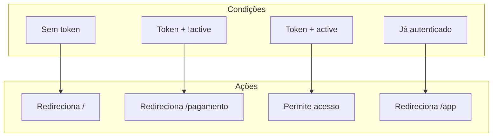

### 8.3 Tabela de Redirecionamentos

| Página Atual | Condição               | Destino                |
| ------------ | ---------------------- | ---------------------- |
| `/`          | Token válido + active  | `/app`                 |
| `/`          | Token válido + !active | `/pagamento`           |
| `/cadastro`  | Registro sucesso       | `/pagamento`           |
| `/pagamento` | Pagamento confirmado   | `/app` ou `/anaminese` |
| `/anaminese` | Anamnese completa      | `/app`                 |
| `/app`       | Sem token              | `/`                    |
| `/app`       | !active                | `/pagamento`           |
| `/perfil`    | Logout                 | `/`                    |
| `/perfil`    | Cancelamento           | `/pagamento`           |

---

## Referências Cruzadas

- **Arquitetura geral:** [01-ARCHITECTURE.md](01-ARCHITECTURE.md)
- **Componentes:** [02-COMPONENTS.md](02-COMPONENTS.md)
- **Integração com API:** [04-API-INTEGRATION.md](04-API-INTEGRATION.md)
- **Tipos e interfaces:** [05-TYPES-INTERFACES.md](05-TYPES-INTERFACES.md)
- **Hooks e utilitários:** [06-HOOKS-UTILITIES.md](06-HOOKS-UTILITIES.md)
- **Segurança e deploy:** [07-SECURITY-DEPLOY.md](07-SECURITY-DEPLOY.md)

---

> **Próximo:** [04-API-INTEGRATION.md](04-API-INTEGRATION.md) - Integração completa com API
