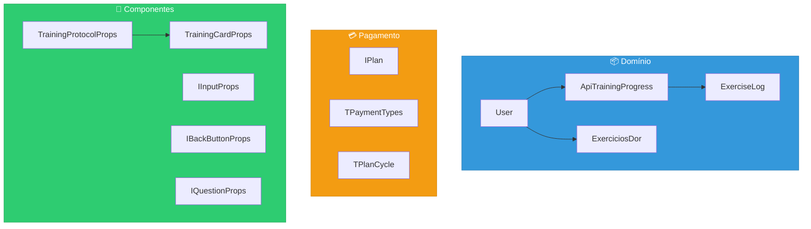
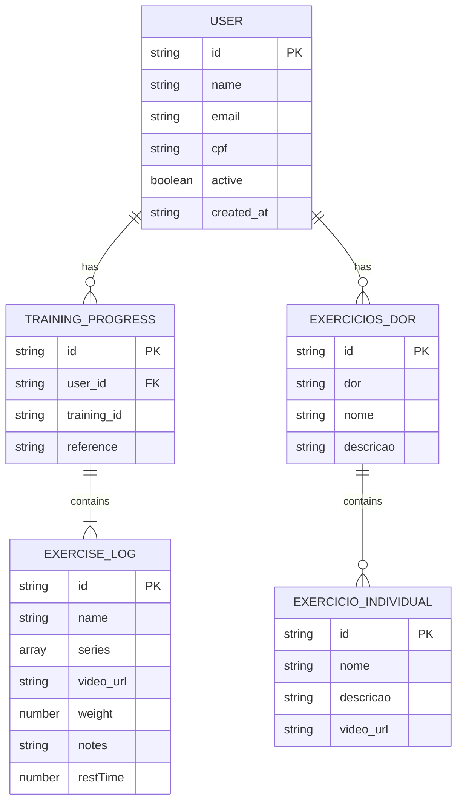
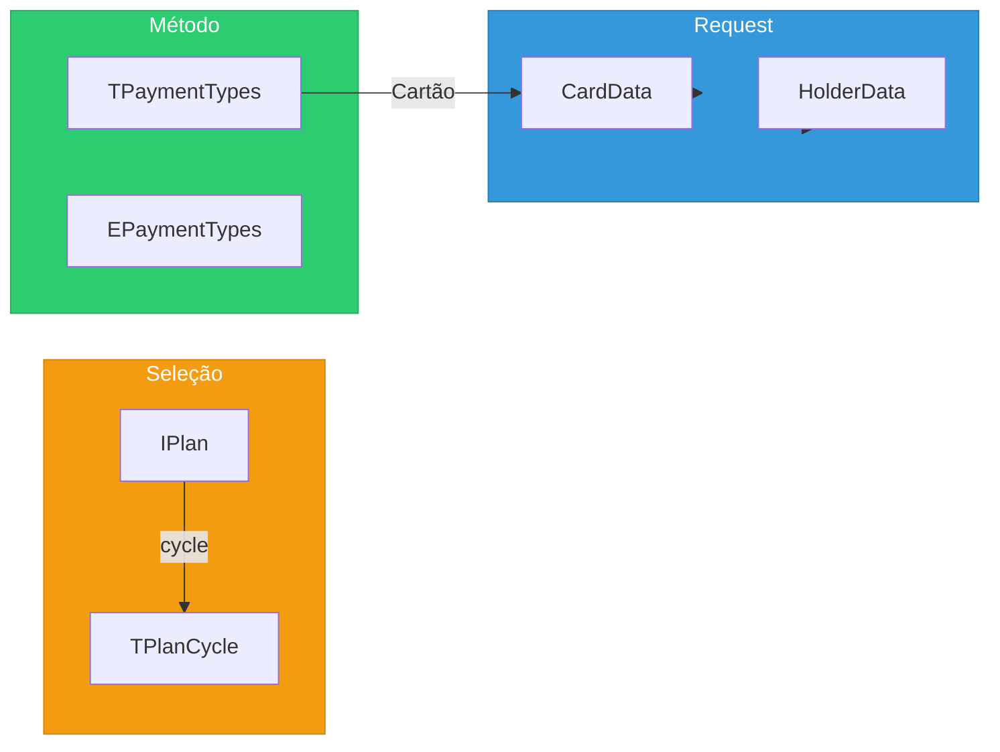

# 📐 Tipos e Interfaces - Personal-Fit Frontend

> **Versão:** 1.0.0  
> **Última atualização:** 23 de Dezembro de 2025  
> **Linguagem:** TypeScript 5

---

## Índice

1. [Visão Geral](#1-visão-geral)
2. [Mapa de Tipos](#2-mapa-de-tipos)
3. [Tipos de Usuário](#3-tipos-de-usuário)
4. [Tipos de Treino](#4-tipos-de-treino)
5. [Tipos de Pagamento](#5-tipos-de-pagamento)
6. [Tipos de Componentes](#6-tipos-de-componentes)
7. [Tipos de Anamnese](#7-tipos-de-anamnese)
8. [Enums](#8-enums)
9. [Diagrama de Entidades](#9-diagrama-de-entidades)
10. [Convenções de Tipagem](#10-convenções-de-tipagem)

---

## 1. Visão Geral

O projeto utiliza TypeScript com tipagem estrita. Os tipos estão organizados em:

| Localização                               | Propósito                                     |
| ----------------------------------------- | --------------------------------------------- |
| `src/components/features/types.tsx`       | Tipos de domínio (treino, exercício, usuário) |
| `src/app/pagamento/interface.ts`          | Tipos de pagamento e assinatura               |
| `src/components/organism/*/interface.ts`  | Props de componentes organism                 |
| `src/components/molecules/*/interface.ts` | Props de componentes molecules                |
| `src/components/templates/*/interface.ts` | Props de componentes templates                |

### Convenções

```typescript
// Interfaces para objetos de dados
interface User { ... }

// Interfaces para props de componentes
interface IComponentNameProps { ... }

// Types para unions e primitivos
type TPaymentTypes = 'CreditCard' | 'PIX';

// Enums para valores fixos
enum EPaymentTypes { ... }
```

---

## 2. Mapa de Tipos



---

## 3. Tipos de Usuário

### 3.1 User

**Arquivo:** `src/components/features/types.tsx`

```typescript
/**
 * Representa um usuário do sistema
 */
export interface User {
    /** Identificador único do usuário */
    id: string;

    /** Nome completo */
    name: string;

    /** Email (usado para login) */
    email?: string;

    /** CPF (apenas dígitos) */
    cpf?: string;

    /** Telefone fixo */
    phone?: string;

    /** Telefone celular */
    mobile_phone?: string;

    /** Status de assinatura ativa */
    active?: boolean;

    /** Data de criação da conta */
    created_at?: string;

    /** Data da última atualização */
    updated_at?: string;

    /** Progresso nos protocolos de treino */
    trainings_progress?: ApiTrainingProgress[];

    /** Exercícios recomendados baseados em dor */
    exercicios_dor_selecionados?: ExerciciosDor[];
}
```

### 3.2 IUser (Simplificado)

**Arquivo:** `src/components/organism/Header/interface.ts`

```typescript
/**
 * Interface simplificada para exibição no Header
 */
export interface IUser {
    id?: string;
    name?: string;
    email?: string;
    phone?: string;
    cpf?: string;
}
```

---

## 4. Tipos de Treino

### 4.1 ExerciseLog

**Arquivo:** `src/components/features/types.tsx`

```typescript
/**
 * Representa um exercício dentro de um treino
 */
export interface ExerciseLog {
    /** Identificador único do exercício */
    id: string;

    /** Nome do exercício */
    name: string;

    /** Array de repetições por série. Ex: [10, 12, 15] */
    series: number[];

    /** Variações ou observações do exercício */
    variations: string;

    /** URL do vídeo/GIF demonstrativo */
    video_url: string;

    /** URL da thumbnail do vídeo */
    video_thumb: string;

    /** Indica se é exercício por tempo (vs repetições) */
    timed: boolean;

    /** Carga em kg */
    weight: number;

    /** Anotações pessoais do usuário */
    notes?: string;

    /** Tempo de descanso entre séries (segundos) */
    restTime: number;
}
```

### 4.2 ApiTrainingProgress

**Arquivo:** `src/components/features/types.tsx`

```typescript
/**
 * Progresso do usuário em um treino específico
 */
export interface ApiTrainingProgress {
    /** ID do registro de progresso */
    id: string;

    /** ID do usuário */
    user_id: string;

    /** ID do treino */
    training_id: string;

    /** Referência/nome do protocolo. Ex: "Protocolo A" */
    reference: string;

    /** Lista de exercícios do treino */
    exercise_logs: ExerciseLog[];
}
```

### 4.3 TrainingCardProps

**Arquivo:** `src/components/features/types.tsx`

```typescript
/**
 * Props para o componente TrainingCard
 */
export interface TrainingCardProps {
    /** ID único do treino */
    id: string;

    /** Label exibido no card. Ex: "Treino A" */
    label: string;
}
```

### 4.4 TrainingProtocolProps

**Arquivo:** `src/components/features/types.tsx`

```typescript
/**
 * Props para o componente TrainingProtocol
 */
export interface TrainingProtocolProps {
    /** ID do protocolo */
    protocolId: string;

    /** Número do protocolo para exibição */
    protocolNumber: number;

    /** Lista de treinos do protocolo */
    trainings: TrainingCardProps[];
}
```

### 4.5 TrainingProtocolListProps

**Arquivo:** `src/components/features/types.tsx`

```typescript
/**
 * Props para o componente TrainingProtocolList
 */
export interface TrainingProtocolListProps {
    /** ID do protocolo */
    protocolId: string;

    /** Número do protocolo */
    protocolNumber: number;

    /** Lista de treinos */
    trainings: TrainingCardProps[];
}
```

### 4.6 ProtocolListItem

**Arquivo:** `src/components/features/types.tsx`

```typescript
/**
 * Item simplificado para listas de protocolo
 */
export interface ProtocolListItem {
    id: string;
    label: string;
}
```

---

## 5. Tipos de Pagamento

### 5.1 IPlan

**Arquivo:** `src/app/pagamento/interface.ts`

```typescript
/**
 * Representa um plano de assinatura
 */
export interface IPlan {
    /** Nome do plano. Ex: "Plano Bimestral" */
    name: string;

    /** Valor em reais */
    value: number;

    /** Descrição detalhada */
    description: string;

    /** Ciclo de cobrança */
    cycle: TPlanCycle;
}
```

### 5.2 TPaymentTypes

**Arquivo:** `src/app/pagamento/interface.ts`

```typescript
/**
 * Tipos de pagamento aceitos
 */
export type TPaymentTypes = 'CreditCard' | 'PIX';
```

### 5.3 EPaymentTypes

**Arquivo:** `src/app/pagamento/interface.ts`

```typescript
/**
 * Enum de tipos de pagamento
 */
export enum EPaymentTypes {
    CreditCard = 'CreditCard',
    PIX = 'PIX',
}
```

### 5.4 TPlanCycle

**Arquivo:** `src/app/pagamento/interface.ts`

```typescript
/**
 * Ciclos de assinatura disponíveis
 */
export type TPlanCycle = 'BIMONTHLY' | 'SEMIANNUALLY' | 'YEARLY';
```

### 5.5 SubscriptionStatus (Backend)

```typescript
/**
 * Status possíveis de assinatura (definido no backend)
 */
type SubscriptionStatus =
    | 'UNKNOWN'
    | 'ACTIVE'
    | 'CANCELED'
    | 'EXPIRED'
    | 'SUSPENDED';
```

---

## 6. Tipos de Componentes

### 6.1 IInputProps

**Arquivo:** `src/components/molecules/Input/interface.ts`

```typescript
import { InputHTMLAttributes } from 'react';

/**
 * Props do componente Input (estende atributos HTML nativos)
 */
export interface IInputProps extends InputHTMLAttributes<HTMLInputElement> {
    // Herda todas as props de <input>:
    // type, value, onChange, placeholder, disabled, etc.
}
```

### 6.2 IBackButtonProps

**Arquivo:** `src/components/molecules/BackButton/interface.ts`

```typescript
/**
 * Props do componente BackButton
 */
export interface IBackButtonProps {
    /** Callback executado ao clicar */
    onClick: () => void;

    /** URL de destino para navegação */
    link: string;

    /** Texto exibido no botão */
    label: string;
}
```

### 6.3 IHeaderProps

**Arquivo:** `src/components/organism/Header/interface.ts`

```typescript
/**
 * Props do componente Header
 */
export interface IHeaderProps {
    /** Nome do usuário para exibição */
    userName?: string;

    /** Exibe menu hamburguer */
    showMenu?: boolean;

    /** Exibe botão voltar */
    showBackButton?: boolean;

    /** Callback do botão voltar */
    onBackClick?: () => void;
}
```

### 6.4 IProtocolsProps

**Arquivo:** `src/components/templates/Protocols/interface.ts`

```typescript
/**
 * Interface de protocolo para o template
 */
export interface IProtocol {
    /** ID numérico do protocolo */
    id: number;

    /** Referência/nome do protocolo */
    reference: string;

    /** Lista de exercícios */
    exercise_logs: Array<{
        id: number;
        name: string;
        sets: number;
        repetitions: number;
        rest_time: number;
        weight: number;
    }>;
}
```

---

## 7. Tipos de Anamnese

### 7.1 IQuestionProps

**Arquivo:** `src/components/organism/QuestionsRenderer/interface.ts`

```typescript
/**
 * Representa uma pergunta da anamnese
 */
export interface IQuestionProps {
    /** ID único da pergunta */
    id: string;

    /** Texto da pergunta */
    text: string;

    /** Opções de resposta */
    options: Array<{
        /** ID da pergunta pai */
        question_id: string;

        /** ID da resposta */
        answer_id: string;

        /** Texto da opção */
        text: string;
    }>;
}
```

### 7.2 IQuestionsRendererProps

**Arquivo:** `src/components/organism/QuestionsRenderer/interface.ts`

```typescript
/**
 * Props do componente QuestionsRenderer
 */
export interface IQuestionsRendererProps {
    /** Array de perguntas */
    questions: Array<IQuestionProps>;

    /** Callback de submissão com respostas */
    submitQuestions: (questions: { [key: string]: string }) => void;
}
```

### 7.3 ExerciciosDor

**Arquivo:** `src/components/features/types.tsx`

```typescript
/**
 * Exercícios recomendados para uma área de dor específica
 */
export interface ExerciciosDor {
    /** ID opcional */
    id?: string;

    /** Nome da área de dor. Ex: "Dor no joelho" */
    dor: string;

    /** Nome do grupo de exercícios */
    nome?: string;

    /** Descrição geral */
    descricao?: string;

    /** URL de vídeo demonstrativo geral */
    video_url?: string;

    /** Lista de exercícios individuais */
    exercicios?: ExercicioIndividual[];
}
```

### 7.4 ExercicioIndividual

**Arquivo:** `src/components/features/types.tsx`

```typescript
/**
 * Um exercício individual para dor específica
 */
export interface ExercicioIndividual {
    /** ID opcional */
    id?: string;

    /** Nome do exercício */
    nome: string;

    /** Descrição de execução */
    descricao?: string;

    /** URL do vídeo demonstrativo */
    video_url?: string;
}
```

---

## 8. Enums

### 8.1 EPaymentTypes

```typescript
export enum EPaymentTypes {
    CreditCard = 'CreditCard',
    PIX = 'PIX',
}

// Uso
if (paymentMethod === EPaymentTypes.CreditCard) {
    // Processa cartão
}
```

### 8.2 Ciclos de Assinatura (Implícito)

```typescript
// Usado como constantes
const PLAN_CYCLES = {
    BIMONTHLY: 'BIMONTHLY',
    SEMIANNUALLY: 'SEMIANNUALLY',
    YEARLY: 'YEARLY',
} as const;

type TPlanCycle = keyof typeof PLAN_CYCLES;
```

### 8.3 Status de Usuário (Implícito)

```typescript
// user.active é boolean
// true = assinatura ativa
// false = sem assinatura ou cancelada
```

---

## 9. Diagrama de Entidades

### 9.1 Relacionamento de Tipos



### 9.2 Hierarquia de Dados do Usuário

```mermaid
graph TD
    subgraph USER["User"]
        U_ID[id]
        U_NAME[name]
        U_EMAIL[email]
        U_ACTIVE[active]

        subgraph TRAININGS["trainings_progress[]"]
            TP[ApiTrainingProgress]

            subgraph EXERCISES["exercise_logs[]"]
                EL[ExerciseLog]
                EL_SERIES[series: number[]]
                EL_NOTES[notes: string]
            end
        end

        subgraph DORES["exercicios_dor_selecionados[]"]
            ED[ExerciciosDor]

            subgraph EX_IND["exercicios[]"]
                EI[ExercicioIndividual]
            end
        end
    end

    TP --> EXERCISES
    ED --> EX_IND

    style USER fill:#3498db,stroke:#2980b9,color:#fff
    style TRAININGS fill:#9b59b6,stroke:#8e44ad,color:#fff
    style DORES fill:#e74c3c,stroke:#c0392b,color:#fff
```

### 9.3 Fluxo de Tipos no Pagamento



---

## 10. Convenções de Tipagem

### 10.1 Nomenclatura

| Tipo               | Prefixo         | Exemplo                       |
| ------------------ | --------------- | ----------------------------- |
| Interface de dados | Nenhum          | `User`, `ExerciseLog`         |
| Interface de props | `I`             | `IInputProps`, `IHeaderProps` |
| Type union/alias   | `T`             | `TPaymentTypes`, `TPlanCycle` |
| Enum               | `E`             | `EPaymentTypes`               |
| Generic            | `T` + Descrição | `TResponse<T>`                |

### 10.2 Organização de Arquivos

```typescript
// ✅ CORRETO - Tipos em arquivo separado
// components/molecules/Input/interface.ts
export interface IInputProps { ... }

// components/molecules/Input/index.tsx
import type { IInputProps } from './interface';

// ✅ CORRETO - Tipos de domínio centralizados
// components/features/types.tsx
export interface User { ... }
export interface ExerciseLog { ... }
```

### 10.3 Props de Componentes

```typescript
// ✅ CORRETO - Interface explícita
interface MyComponentProps {
    id: string;
    onAction: (id: string) => void;
    children?: React.ReactNode;
}

export default function MyComponent({
    id,
    onAction,
    children,
}: MyComponentProps) {
    // ...
}

// ❌ INCORRETO - Tipos inline
export default function MyComponent({
    id,
    onAction,
}: {
    id: string;
    onAction: (id: string) => void;
}) {
    // ...
}
```

### 10.4 Campos Opcionais

```typescript
// ✅ Use ? para campos opcionais
interface User {
    id: string; // Obrigatório
    name: string; // Obrigatório
    email?: string; // Opcional
    phone?: string; // Opcional
}

// ✅ Use valores padrão em props
interface Props {
    size?: 'sm' | 'md' | 'lg';
}

function Component({ size = 'md' }: Props) {
    // size tem valor padrão
}
```

### 10.5 Arrays e Objetos

```typescript
// ✅ Arrays tipados
series: number[];                    // Array de números
trainings: TrainingCardProps[];      // Array de objetos

// ✅ Records para objetos dinâmicos
answers: Record<string, string>;     // { [questionId]: answerId }

// ✅ Generics para reutilização
interface ApiResponse<T> {
  data: T;
  error?: string;
  status: number;
}
```

### 10.6 Type Guards

```typescript
// Verificação de tipo em runtime
function isUser(obj: unknown): obj is User {
    return (
        typeof obj === 'object' && obj !== null && 'id' in obj && 'name' in obj
    );
}

// Uso
const data = JSON.parse(localStorage.getItem('user') || '{}');
if (isUser(data)) {
    // data é User
    console.log(data.name);
}
```

### 10.7 Tipos Utilitários

```typescript
// Partial - Todos os campos opcionais
type PartialUser = Partial<User>;

// Required - Todos os campos obrigatórios
type RequiredUser = Required<User>;

// Pick - Selecionar campos
type UserBasic = Pick<User, 'id' | 'name'>;

// Omit - Excluir campos
type UserWithoutId = Omit<User, 'id'>;

// Record - Objeto com chaves tipadas
type UserMap = Record<string, User>;
```

---

## Referências Cruzadas

- **Arquitetura geral:** [01-ARCHITECTURE.md](01-ARCHITECTURE.md)
- **Componentes:** [02-COMPONENTS.md](02-COMPONENTS.md)
- **Páginas e rotas:** [03-PAGES-ROUTES.md](03-PAGES-ROUTES.md)
- **Integração com API:** [04-API-INTEGRATION.md](04-API-INTEGRATION.md)
- **Hooks e utilitários:** [06-HOOKS-UTILITIES.md](06-HOOKS-UTILITIES.md)
- **Segurança e deploy:** [07-SECURITY-DEPLOY.md](07-SECURITY-DEPLOY.md)

---

> **Próximo:** [06-HOOKS-UTILITIES.md](06-HOOKS-UTILITIES.md) - Hooks e utilitários
