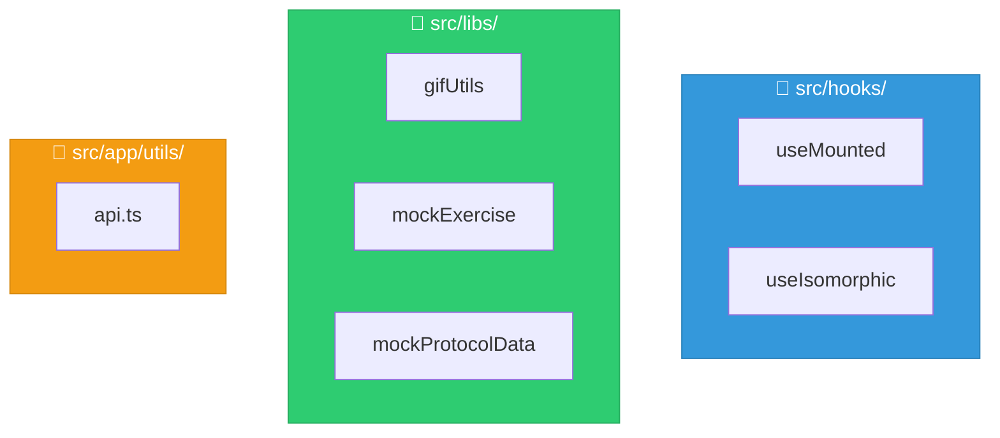
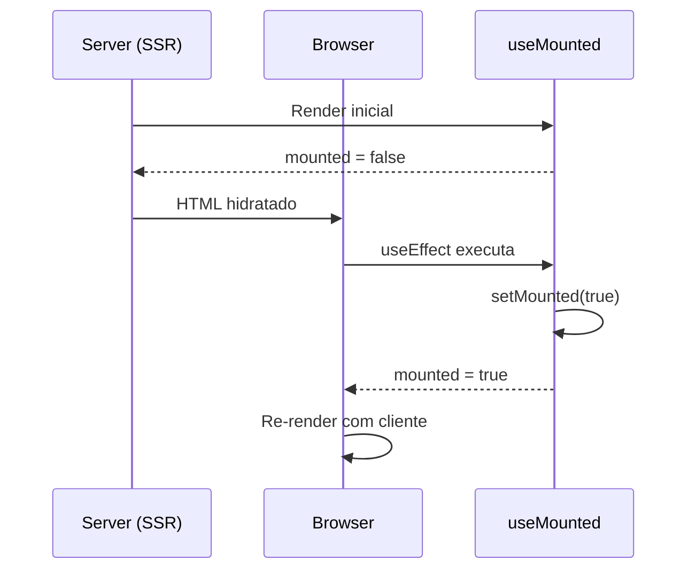
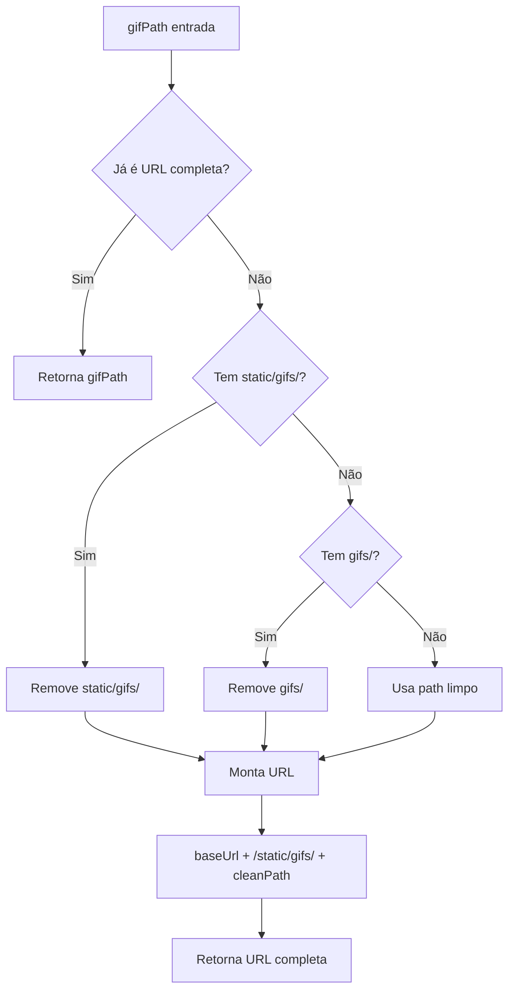
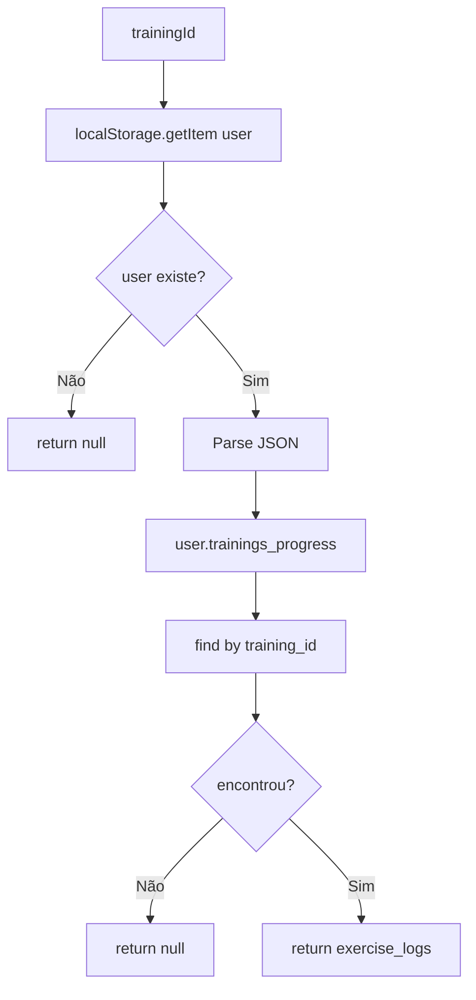
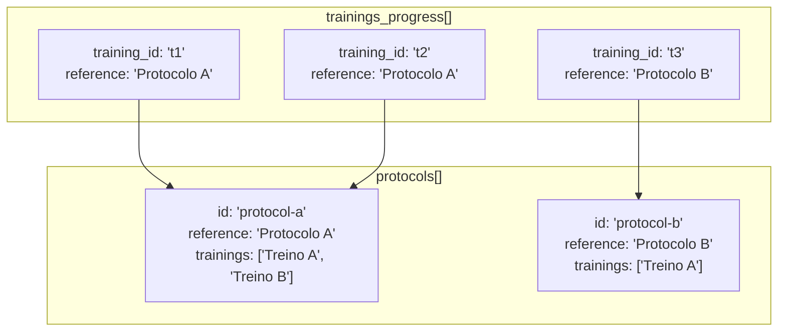
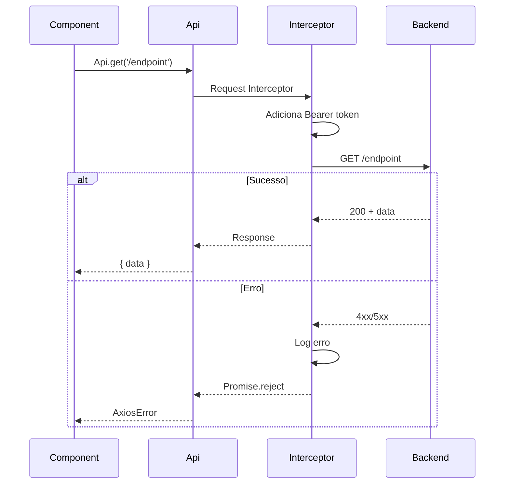
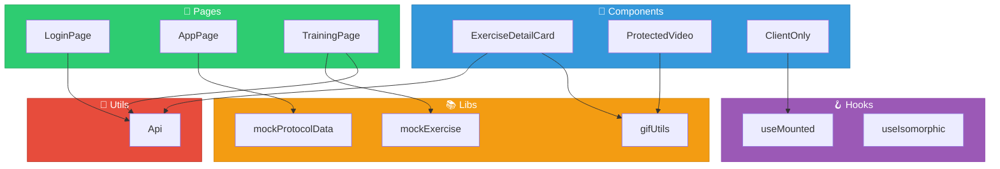

# 🪝 Hooks e Utilitários - Personal-Fit Frontend

> **Versão:** 1.0.0  
> **Última atualização:** 23 de Dezembro de 2025  
> **Localização:** `src/hooks/` e `src/libs/`

---

## Índice

1. [Visão Geral](#1-visão-geral)
2. [Hooks Customizados](#2-hooks-customizados)
3. [Utilitários de GIF](#3-utilitários-de-gif)
4. [Utilitários de Dados Mock](#4-utilitários-de-dados-mock)
5. [Cliente API](#5-cliente-api)
6. [Helpers de Formatação](#6-helpers-de-formatação)
7. [Diagrama de Dependências](#7-diagrama-de-dependências)
8. [Boas Práticas](#8-boas-práticas)

---

## 1. Visão Geral

O projeto possui hooks e utilitários organizados em duas pastas principais:



### Resumo

| Categoria | Arquivos | Propósito                    |
| --------- | -------- | ---------------------------- |
| **Hooks** | 2        | Lógica reutilizável de React |
| **Libs**  | 4        | Utilitários e dados mock     |
| **Utils** | 1        | Cliente HTTP                 |

---

## 2. Hooks Customizados

### 2.1 useMounted

**Arquivo:** `src/hooks/useMounted.ts`

```typescript
import { useState, useEffect } from 'react';

/**
 * Hook que detecta se o componente está montado no cliente.
 * Útil para evitar erros de hidratação SSR/CSR.
 *
 * @returns {boolean} true se montado no cliente, false durante SSR
 *
 * @example
 * const isMounted = useMounted();
 * if (!isMounted) return <Skeleton />;
 * return <ClientOnlyComponent />;
 */
export const useMounted = (): boolean => {
    const [mounted, setMounted] = useState(false);

    useEffect(() => {
        setMounted(true);
    }, []);

    return mounted;
};

export default useMounted;
```

**Propósito:**

- Detectar quando o componente foi montado no cliente
- Evitar erros de hidratação (SSR vs CSR)
- Prevenir acesso a APIs do browser durante SSR (localStorage, window)

**Uso Comum:**

```typescript
'use client';

import { useMounted } from '@/hooks/useMounted';

export default function MyComponent() {
  const isMounted = useMounted();

  // Evita renderizar código client-only durante SSR
  if (!isMounted) {
    return <LoadingSpinner />;
  }

  // Agora é seguro usar localStorage, window, etc.
  const token = localStorage.getItem('token');

  return <AuthenticatedContent token={token} />;
}
```

**Fluxo:**



---

### 2.2 useIsomorphic

**Arquivo:** `src/hooks/useIsomorphic.ts`

```typescript
import { useEffect, useLayoutEffect } from 'react';

/**
 * Hook isomórfico que usa useLayoutEffect no cliente
 * e useEffect no servidor (para evitar warnings SSR).
 *
 * @description
 * useLayoutEffect gera warnings quando executado no servidor.
 * Este hook automaticamente escolhe o correto baseado no ambiente.
 */
export const useIsomorphicLayoutEffect =
    typeof window !== 'undefined' ? useLayoutEffect : useEffect;

/**
 * Hook para acessar localStorage de forma segura.
 * Retorna null durante SSR e o valor real no cliente.
 *
 * @param key - Chave do localStorage
 * @param initialValue - Valor inicial se não existir
 * @returns Tupla [value, setValue]
 *
 * @example
 * const [token, setToken] = useLocalStorage('token', null);
 */
export const useLocalStorage = <T>(
    key: string,
    initialValue: T | null = null,
): [T | null, (value: T) => void] => {
    const [storedValue, setStoredValue] = useState<T | null>(() => {
        if (typeof window === 'undefined') {
            return initialValue;
        }

        try {
            const item = window.localStorage.getItem(key);
            return item ? JSON.parse(item) : initialValue;
        } catch (error) {
            console.error(`[useLocalStorage] Erro ao ler ${key}:`, error);
            return initialValue;
        }
    });

    const setValue = (value: T) => {
        try {
            setStoredValue(value);
            if (typeof window !== 'undefined') {
                window.localStorage.setItem(key, JSON.stringify(value));
            }
        } catch (error) {
            console.error(`[useLocalStorage] Erro ao salvar ${key}:`, error);
        }
    };

    return [storedValue, setValue];
};
```

**Propósito:**

- `useIsomorphicLayoutEffect`: Usar `useLayoutEffect` sem warnings SSR
- `useLocalStorage`: Acessar localStorage de forma isomórfica

**Uso de useIsomorphicLayoutEffect:**

```typescript
import { useIsomorphicLayoutEffect } from '@/hooks/useIsomorphic';

export default function AnimatedComponent() {
  const ref = useRef<HTMLDivElement>(null);

  // Executa antes do paint no cliente, sem warnings no servidor
  useIsomorphicLayoutEffect(() => {
    if (ref.current) {
      ref.current.style.opacity = '1';
    }
  }, []);

  return <div ref={ref}>Conteúdo</div>;
}
```

**Uso de useLocalStorage:**

```typescript
import { useLocalStorage } from '@/hooks/useIsomorphic';

export default function UserPreferences() {
  const [theme, setTheme] = useLocalStorage('theme', 'dark');

  return (
    <button onClick={() => setTheme(theme === 'dark' ? 'light' : 'dark')}>
      Tema atual: {theme}
    </button>
  );
}
```

---

## 3. Utilitários de GIF

### 3.1 gifUtils

**Arquivo:** `src/libs/gifUtils.ts`

```typescript
/**
 * Obtém a URL base da API
 * @returns URL base configurada ou fallback local
 */
export function getApiBaseUrl(): string {
    return process.env.NEXT_PUBLIC_API_URL || 'http://localhost:8080';
}

/**
 * Constrói URL completa para um GIF de exercício
 *
 * @param gifPath - Caminho do GIF (relativo ou absoluto)
 * @returns URL completa para o GIF
 *
 * @example
 * getGifUrl('Agachamento_Livre.gif')
 * // => "https://api.example.com/static/gifs/Agachamento_Livre.gif"
 *
 * getGifUrl('static/gifs/Agachamento_Livre.gif')
 * // => "https://api.example.com/static/gifs/Agachamento_Livre.gif"
 */
export function getGifUrl(gifPath: string): string {
    const baseUrl = getApiBaseUrl();

    // Se já é URL completa, retorna
    if (gifPath.startsWith('http://') || gifPath.startsWith('https://')) {
        return gifPath;
    }

    // Remove prefixos variados e normaliza
    let cleanPath = gifPath;

    // Remove "static/gifs/" se presente
    cleanPath = cleanPath.replace(/^static\/gifs\//, '');

    // Remove "gifs/" se presente
    cleanPath = cleanPath.replace(/^gifs\//, '');

    // Remove "/" inicial se presente
    cleanPath = cleanPath.replace(/^\//, '');

    return `${baseUrl}/static/gifs/${cleanPath}`;
}

/**
 * Verifica se um arquivo é GIF baseado na extensão
 *
 * @param path - Caminho do arquivo
 * @returns true se for .gif
 */
export function isGifFile(path: string): boolean {
    return path.toLowerCase().endsWith('.gif');
}

/**
 * Lista todos os GIFs disponíveis no servidor
 *
 * @returns Array de nomes de arquivos GIF
 * @note Esta função é um stub - requer implementação backend
 */
export async function listAvailableGifs(): Promise<string[]> {
    try {
        const response = await fetch(`${getApiBaseUrl()}/static/gifs/list`);
        if (!response.ok) {
            throw new Error('Falha ao listar GIFs');
        }
        return await response.json();
    } catch (error) {
        console.error('[listAvailableGifs] Erro:', error);
        return [];
    }
}

/**
 * Valida se um GIF existe no servidor
 *
 * @param gifPath - Caminho do GIF
 * @returns true se o GIF existe e está acessível
 */
export async function validateGifExists(gifPath: string): Promise<boolean> {
    try {
        const url = getGifUrl(gifPath);
        const response = await fetch(url, { method: 'HEAD' });
        return response.ok;
    } catch (error) {
        console.error('[validateGifExists] Erro:', error);
        return false;
    }
}
```

**Diagrama de Resolução de URL:**



**Exemplos de Transformação:**

| Entrada                       | Saída                                        |
| ----------------------------- | -------------------------------------------- |
| `Agachamento.gif`             | `https://api.../static/gifs/Agachamento.gif` |
| `gifs/Agachamento.gif`        | `https://api.../static/gifs/Agachamento.gif` |
| `static/gifs/Agachamento.gif` | `https://api.../static/gifs/Agachamento.gif` |
| `https://outro.com/img.gif`   | `https://outro.com/img.gif`                  |

---

## 4. Utilitários de Dados Mock

### 4.1 mockExercise

**Arquivo:** `src/libs/mockExercise.ts`

```typescript
import type { ExerciseLog } from '@/components/features/types';

/**
 * Busca exercícios de um treino específico do localStorage
 *
 * @param trainingId - ID do treino
 * @returns Promise com dados do exercício ou null
 *
 * @description
 * Navega pela estrutura: user.trainings_progress → training_id → exercise_logs
 */
export const getExercisesByTrainingId = async (
    trainingId: string,
): Promise<ExerciseLog[] | null> => {
    try {
        // Busca usuário do localStorage
        const userStr = localStorage.getItem('user');
        if (!userStr) {
            console.warn('[getExercisesByTrainingId] Usuário não encontrado');
            return null;
        }

        const user = JSON.parse(userStr);

        // Busca o treino específico
        const trainingProgress = user.trainings_progress?.find(
            (tp: { training_id: string }) => tp.training_id === trainingId,
        );

        if (!trainingProgress) {
            console.warn(
                `[getExercisesByTrainingId] Treino ${trainingId} não encontrado`,
            );
            return null;
        }

        return trainingProgress.exercise_logs || [];
    } catch (error) {
        console.error('[getExercisesByTrainingId] Erro:', error);
        return null;
    }
};
```

**Fluxo de Dados:**



---

### 4.2 mockProtocolData

**Arquivo:** `src/libs/mockProtocolData.ts`

```typescript
import type { ApiTrainingProgress } from '@/components/features/types';

/**
 * Interface de resposta da API de protocolos
 */
interface ApiResponse {
    id: string;
    reference: string;
    trainings: Array<{
        id: string;
        label: string;
    }>;
}

/**
 * Busca dados de um protocolo específico pelo ID
 *
 * @param protocolId - ID do protocolo
 * @returns Dados do protocolo ou null
 */
export const getProtocolDataById = async (
    protocolId: string,
): Promise<ApiResponse | null> => {
    try {
        const userStr = localStorage.getItem('user');
        if (!userStr) return null;

        const user = JSON.parse(userStr);
        const protocols = groupTrainingsByProtocol(
            user.trainings_progress || [],
        );

        return protocols.find((p) => p.id === protocolId) || null;
    } catch (error) {
        console.error('[getProtocolDataById] Erro:', error);
        return null;
    }
};

/**
 * Busca todos os protocolos de um usuário
 *
 * @param userId - ID do usuário (não utilizado, usa localStorage)
 * @returns Array de protocolos com seus dados
 */
export const getProtocolsByUserId = async (
    userId: string,
): Promise<Array<{ protocolId: string; data: ApiResponse }>> => {
    try {
        const userStr = localStorage.getItem('user');
        if (!userStr) return [];

        const user = JSON.parse(userStr);
        const protocols = groupTrainingsByProtocol(
            user.trainings_progress || [],
        );

        return protocols.map((p) => ({
            protocolId: p.id,
            data: p,
        }));
    } catch (error) {
        console.error('[getProtocolsByUserId] Erro:', error);
        return [];
    }
};

/**
 * Agrupa treinos por protocolo baseado no campo reference
 *
 * @param trainings - Array de trainings_progress
 * @returns Array de protocolos agrupados
 */
function groupTrainingsByProtocol(
    trainings: ApiTrainingProgress[],
): ApiResponse[] {
    const protocolMap = new Map<string, ApiResponse>();

    trainings.forEach((training) => {
        const reference = training.reference || 'Protocolo Padrão';

        if (!protocolMap.has(reference)) {
            protocolMap.set(reference, {
                id: generateProtocolId(reference),
                reference,
                trainings: [],
            });
        }

        const protocol = protocolMap.get(reference)!;
        protocol.trainings.push({
            id: training.training_id,
            label: `Treino ${String.fromCharCode(65 + protocol.trainings.length)}`, // A, B, C...
        });
    });

    return Array.from(protocolMap.values());
}

/**
 * Gera ID único para protocolo baseado no reference
 */
function generateProtocolId(reference: string): string {
    return `protocol-${reference.toLowerCase().replace(/\s+/g, '-')}`;
}
```

**Estrutura de Agrupamento:**



---

### 4.3 mockProtocolData2

**Arquivo:** `src/libs/mockProtocolData2.ts`

Variação alternativa com estrutura similar para casos específicos.

---

## 5. Cliente API

### 5.1 api.ts

**Arquivo:** `src/app/utils/api.ts`

```typescript
import axios, { AxiosInstance, AxiosError } from 'axios';

/**
 * Instância configurada do Axios para comunicação com o backend
 */
export const Api: AxiosInstance = axios.create({
    baseURL: process.env.NEXT_PUBLIC_API_URL,
    headers: {
        'Content-Type': 'application/json',
    },
    timeout: 30000, // 30 segundos
});

/**
 * Interceptor de request - Adiciona token de autenticação
 */
Api.interceptors.request.use(
    (config) => {
        if (typeof window !== 'undefined') {
            const token = localStorage.getItem('token');
            if (token) {
                config.headers.Authorization = `Bearer ${token}`;
            }
        }
        return config;
    },
    (error) => {
        return Promise.reject(error);
    },
);

/**
 * Interceptor de response - Tratamento global de erros
 */
Api.interceptors.response.use(
    (response) => response,
    (error: AxiosError) => {
        // Log estruturado de erros
        console.error('[Api] Erro:', {
            url: error.config?.url,
            method: error.config?.method,
            status: error.response?.status,
            message: error.message,
        });

        return Promise.reject(error);
    },
);

/**
 * Resultado da operação de salvar notas
 */
interface SaveNotesResult {
    success: boolean;
    message?: string;
    error?: string;
}

/**
 * Salva anotações de um exercício específico
 *
 * @param trainingId - ID do treino
 * @param exerciseId - ID do exercício
 * @param notes - Texto das anotações
 * @returns Resultado da operação
 *
 * @example
 * const result = await saveExerciseNotes('t123', 'e456', 'Aumentar carga');
 * if (result.success) {
 *   showToast('Notas salvas!');
 * } else {
 *   showError(result.error);
 * }
 */
export async function saveExerciseNotes(
    trainingId: string,
    exerciseId: string,
    notes: string,
): Promise<SaveNotesResult> {
    try {
        await Api.put(
            `/user/training/${trainingId}/exercise/${exerciseId}/notes`,
            { notes },
        );

        // Atualiza localStorage para manter sincronizado
        updateLocalNotes(trainingId, exerciseId, notes);

        return {
            success: true,
            message: 'Notas salvas com sucesso',
        };
    } catch (error) {
        const message = axios.isAxiosError(error)
            ? error.response?.data?.error || 'Erro ao salvar notas'
            : 'Erro desconhecido';

        return {
            success: false,
            error: message,
        };
    }
}

/**
 * Atualiza notas no localStorage para manter cache sincronizado
 */
function updateLocalNotes(
    trainingId: string,
    exerciseId: string,
    notes: string,
): void {
    try {
        const userStr = localStorage.getItem('user');
        if (!userStr) return;

        const user = JSON.parse(userStr);

        // Encontra e atualiza o exercício
        user.trainings_progress?.forEach((tp: any) => {
            if (tp.training_id === trainingId) {
                tp.exercise_logs?.forEach((ex: any) => {
                    if (ex.id === exerciseId) {
                        ex.notes = notes;
                    }
                });
            }
        });

        localStorage.setItem('user', JSON.stringify(user));
    } catch (error) {
        console.error('[updateLocalNotes] Erro:', error);
    }
}
```

**Diagrama do Fluxo de Request:**



---

## 6. Helpers de Formatação

### 6.1 Formatadores de Input

```typescript
// Geralmente inline nos componentes, mas podem ser extraídos

/**
 * Formata CPF para exibição
 * @param value - CPF apenas dígitos
 * @returns CPF formatado (000.000.000-00)
 */
export function formatCPF(value: string): string {
    const digits = value.replace(/\D/g, '').slice(0, 11);

    if (digits.length <= 3) return digits;
    if (digits.length <= 6) return `${digits.slice(0, 3)}.${digits.slice(3)}`;
    if (digits.length <= 9)
        return `${digits.slice(0, 3)}.${digits.slice(3, 6)}.${digits.slice(6)}`;
    return `${digits.slice(0, 3)}.${digits.slice(3, 6)}.${digits.slice(6, 9)}-${digits.slice(9)}`;
}

/**
 * Formata telefone para exibição
 * @param value - Telefone apenas dígitos
 * @returns Telefone formatado
 */
export function formatPhone(value: string): string {
    const digits = value.replace(/\D/g, '').slice(0, 11);

    if (digits.length <= 2) return digits;
    if (digits.length <= 6) return `(${digits.slice(0, 2)}) ${digits.slice(2)}`;
    if (digits.length <= 10)
        return `(${digits.slice(0, 2)}) ${digits.slice(2, 6)}-${digits.slice(6)}`;
    return `(${digits.slice(0, 2)}) ${digits.slice(2, 7)}-${digits.slice(7)}`;
}

/**
 * Formata CEP para exibição
 * @param value - CEP apenas dígitos
 * @returns CEP formatado (00000-000)
 */
export function formatCEP(value: string): string {
    const digits = value.replace(/\D/g, '').slice(0, 8);

    if (digits.length <= 5) return digits;
    return `${digits.slice(0, 5)}-${digits.slice(5)}`;
}

/**
 * Remove formatação para envio à API
 * @param value - Valor formatado
 * @returns Apenas dígitos
 */
export function cleanForAPI(value: string): string {
    return value.replace(/\D/g, '');
}

/**
 * Formata séries de exercício para exibição
 * @param series - Array de repetições [10, 12, 15]
 * @returns String formatada "10 / 12 / 15"
 */
export function formatSeries(series: number[]): string {
    return series.join(' / ');
}

/**
 * Formata tempo em segundos para mm:ss
 * @param seconds - Tempo em segundos
 * @returns String formatada "02:30"
 */
export function formatTime(seconds: number): string {
    const mins = Math.floor(seconds / 60);
    const secs = seconds % 60;
    return `${mins.toString().padStart(2, '0')}:${secs.toString().padStart(2, '0')}`;
}
```

---

## 7. Diagrama de Dependências



---

## 8. Boas Práticas

### 8.1 Criando Novos Hooks

```typescript
// ✅ CORRETO - Hook bem estruturado
import { useState, useEffect, useCallback } from 'react';

/**
 * Hook para gerenciar estado de loading com timeout
 *
 * @param timeout - Tempo máximo de loading em ms
 * @returns Tupla [isLoading, startLoading, stopLoading]
 */
export function useLoadingWithTimeout(timeout = 30000) {
    const [isLoading, setIsLoading] = useState(false);
    const [timeoutId, setTimeoutId] = useState<NodeJS.Timeout | null>(null);

    const startLoading = useCallback(() => {
        setIsLoading(true);

        const id = setTimeout(() => {
            setIsLoading(false);
            console.warn('[useLoadingWithTimeout] Timeout atingido');
        }, timeout);

        setTimeoutId(id);
    }, [timeout]);

    const stopLoading = useCallback(() => {
        setIsLoading(false);
        if (timeoutId) {
            clearTimeout(timeoutId);
        }
    }, [timeoutId]);

    // Cleanup no unmount
    useEffect(() => {
        return () => {
            if (timeoutId) {
                clearTimeout(timeoutId);
            }
        };
    }, [timeoutId]);

    return [isLoading, startLoading, stopLoading] as const;
}
```

### 8.2 Criando Novos Utilitários

```typescript
// ✅ CORRETO - Utilitário bem documentado
/**
 * Valida formato de email
 *
 * @param email - String a validar
 * @returns true se for email válido
 *
 * @example
 * isValidEmail('test@example.com') // true
 * isValidEmail('invalid') // false
 */
export function isValidEmail(email: string): boolean {
    const emailRegex = /^[^\s@]+@[^\s@]+\.[^\s@]+$/;
    return emailRegex.test(email);
}

// ❌ INCORRETO - Sem documentação, nome pouco claro
export function check(e: string): boolean {
    return /^[^\s@]+@[^\s@]+\.[^\s@]+$/.test(e);
}
```

### 8.3 Checklist de Hooks/Utils

| Item | Descrição                                   |
| ---- | ------------------------------------------- |
| ✅   | JSDoc com descrição, parâmetros e exemplos  |
| ✅   | Tratamento de erros com try-catch           |
| ✅   | Cleanup de side effects (timers, listeners) |
| ✅   | Verificação de ambiente (typeof window)     |
| ✅   | Testes unitários (se aplicável)             |
| ✅   | Export nomeado e default                    |

---

## Referências Cruzadas

- **Arquitetura geral:** [01-ARCHITECTURE.md](01-ARCHITECTURE.md)
- **Componentes:** [02-COMPONENTS.md](02-COMPONENTS.md)
- **Páginas e rotas:** [03-PAGES-ROUTES.md](03-PAGES-ROUTES.md)
- **Integração com API:** [04-API-INTEGRATION.md](04-API-INTEGRATION.md)
- **Tipos e interfaces:** [05-TYPES-INTERFACES.md](05-TYPES-INTERFACES.md)
- **Segurança e deploy:** [07-SECURITY-DEPLOY.md](07-SECURITY-DEPLOY.md)

---

> **Próximo:** [07-SECURITY-DEPLOY.md](07-SECURITY-DEPLOY.md) - Segurança e Deploy
