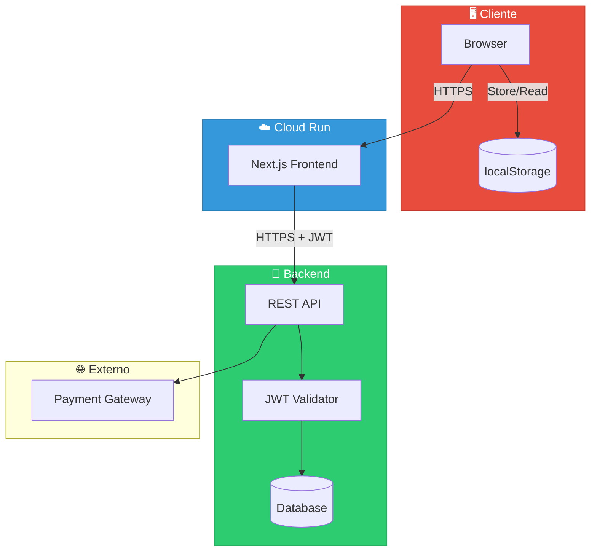
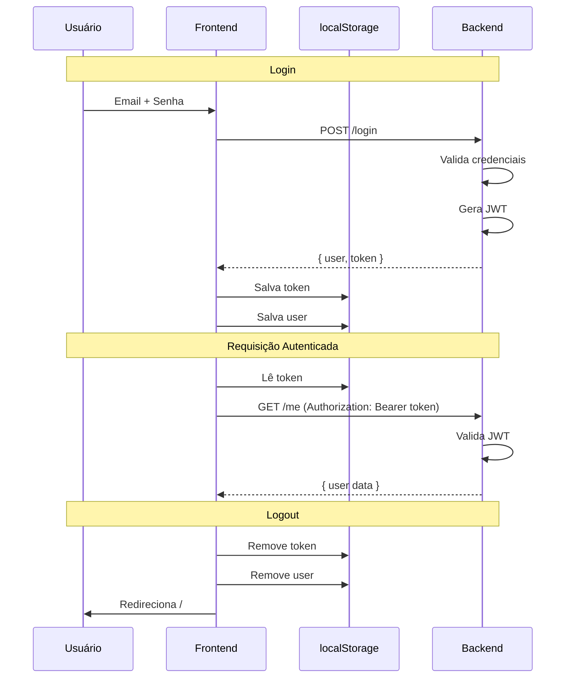
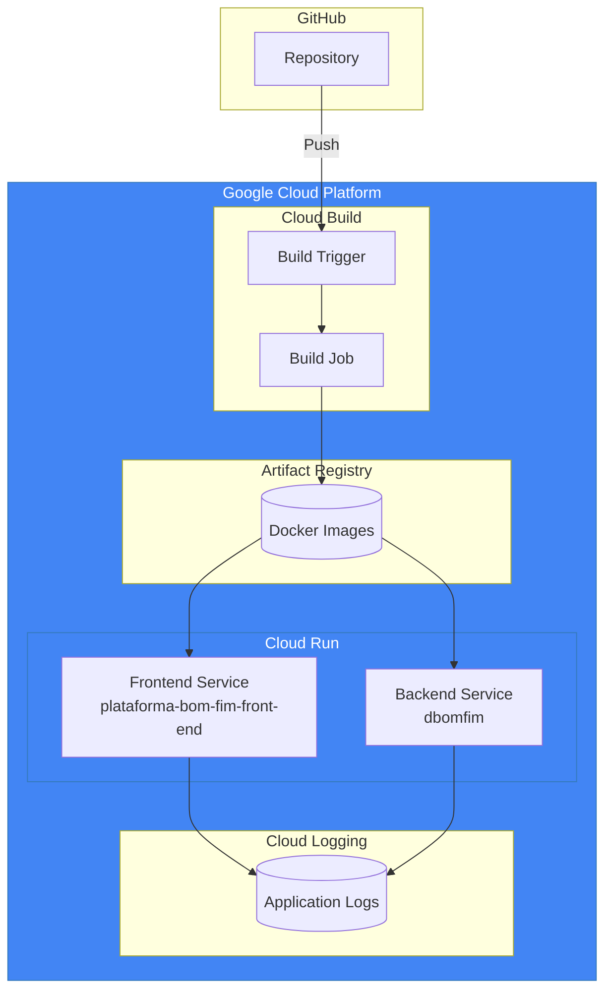
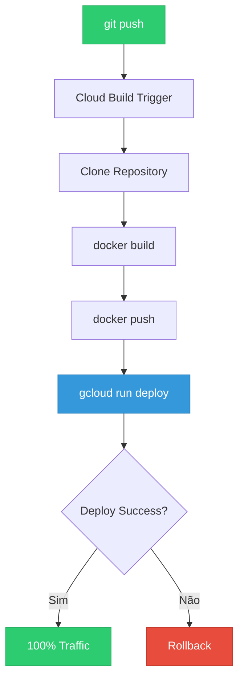

# 🔒 Segurança e Deploy - Personal-Fit Frontend

> **Versão:** 1.0.0  
> **Última atualização:** 23 de Dezembro de 2025  
> **Plataforma:** Google Cloud Run

---

## Índice

1. [Visão Geral de Segurança](#1-visão-geral-de-segurança)
2. [Autenticação JWT](#2-autenticação-jwt)
3. [Proteção de Dados](#3-proteção-de-dados)
4. [CORS e Headers](#4-cors-e-headers)
5. [Validação e Sanitização](#5-validação-e-sanitização)
6. [Arquitetura de Deploy](#6-arquitetura-de-deploy)
7. [Google Cloud Run](#7-google-cloud-run)
8. [CI/CD com Cloud Build](#8-cicd-com-cloud-build)
9. [Variáveis de Ambiente](#9-variáveis-de-ambiente)
10. [Monitoramento e Logs](#10-monitoramento-e-logs)
11. [Checklist de Produção](#11-checklist-de-produção)
12. [Troubleshooting](#12-troubleshooting)

---

## 1. Visão Geral de Segurança

### 1.1 Modelo de Segurança



### 1.2 Matriz de Segurança

| Camada            | Proteção                | Status              |
| ----------------- | ----------------------- | ------------------- |
| **Transporte**    | HTTPS (TLS 1.3)         | ✅ Ativo            |
| **Autenticação**  | JWT Bearer Token        | ✅ Ativo            |
| **Armazenamento** | localStorage (cliente)  | ⚠️ Vulnerável a XSS |
| **Input**         | Sanitização client-side | ✅ Ativo            |
| **CORS**          | Headers configurados    | ✅ Ativo            |
| **Rate Limiting** | Backend                 | ⚠️ Verificar        |

---

## 2. Autenticação JWT

### 2.1 Fluxo de Autenticação



### 2.2 Estrutura do Token

```typescript
// Header
{
  "alg": "HS256",
  "typ": "JWT"
}

// Payload
{
  "sub": "user-uuid",           // ID do usuário
  "email": "user@email.com",
  "iat": 1703318400,            // Issued at
  "exp": 1703404800             // Expiration (24h)
}

// Signature
HMACSHA256(base64UrlEncode(header) + "." + base64UrlEncode(payload), secret)
```

### 2.3 Implementação Frontend

```typescript
// Salvar token após login
const handleLoginSuccess = (data: { user: User; token: string }) => {
    localStorage.setItem('token', data.token);
    localStorage.setItem('user', JSON.stringify(data.user));
};

// Usar token em requisições
Api.interceptors.request.use((config) => {
    const token = localStorage.getItem('token');
    if (token) {
        config.headers.Authorization = `Bearer ${token}`;
    }
    return config;
});

// Verificar autenticação
const checkAuth = (): boolean => {
    const token = localStorage.getItem('token');
    return !!token;
};

// Logout
const logout = () => {
    localStorage.removeItem('token');
    localStorage.removeItem('user');
    window.location.href = '/';
};
```

### 2.4 ⚠️ Peculiaridade do Backend

O backend aceita **dois formatos** de Authorization header:

```typescript
// Formato padrão (maioria das requisições)
Authorization: Bearer eyJhbGci...

// Formato legado (fluxo de pagamento)
Authorization: eyJhbGci...

// O backend deve tratar ambos
const extractToken = (header: string): string => {
  if (header.startsWith('Bearer ')) {
    return header.slice(7);
  }
  return header;
};
```

---

## 3. Proteção de Dados

### 3.1 Dados Sensíveis

| Dado             | Armazenamento    | Proteção                  |
| ---------------- | ---------------- | ------------------------- |
| JWT Token        | localStorage     | Vulnerable a XSS          |
| Dados do usuário | localStorage     | JSON serializado          |
| Senha            | Nunca armazenada | -                         |
| Número do cartão | Não armazenado   | Enviado direto ao backend |
| CVV              | Não armazenado   | Enviado direto ao backend |

### 3.2 Recomendações de Segurança

```typescript
// ❌ NUNCA faça isso
localStorage.setItem('password', password);
localStorage.setItem('cardNumber', cardNumber);

// ✅ CORRETO - Apenas token e dados não sensíveis
localStorage.setItem('token', token);
localStorage.setItem(
    'user',
    JSON.stringify({
        id: user.id,
        name: user.name,
        email: user.email,
        // NÃO incluir: cpf completo, dados financeiros
    }),
);
```

### 3.3 Alternativa Mais Segura (Futuro)

```typescript
// Usar httpOnly cookies para tokens
// Configuração no backend:
Set-Cookie: token=eyJhbGci...; HttpOnly; Secure; SameSite=Strict; Path=/

// Frontend não tem acesso ao token
// Cookie enviado automaticamente em requisições
```

---

## 4. CORS e Headers

### 4.1 Configuração Next.js

**Arquivo:** `next.config.ts`

```typescript
const nextConfig: NextConfig = {
    async headers() {
        return [
            {
                source: '/:path*',
                headers: [
                    {
                        key: 'Access-Control-Allow-Origin',
                        value: '*', // Em produção, especificar domínios
                    },
                    {
                        key: 'Access-Control-Allow-Methods',
                        value: 'GET, POST, PUT, DELETE, OPTIONS',
                    },
                    {
                        key: 'Access-Control-Allow-Headers',
                        value: 'Content-Type, Authorization',
                    },
                    {
                        key: 'X-Content-Type-Options',
                        value: 'nosniff',
                    },
                    {
                        key: 'X-Frame-Options',
                        value: 'DENY',
                    },
                    {
                        key: 'X-XSS-Protection',
                        value: '1; mode=block',
                    },
                ],
            },
        ];
    },
};
```

### 4.2 Headers Recomendados

| Header                      | Valor              | Propósito             |
| --------------------------- | ------------------ | --------------------- |
| `X-Content-Type-Options`    | `nosniff`          | Previne MIME sniffing |
| `X-Frame-Options`           | `DENY`             | Previne clickjacking  |
| `X-XSS-Protection`          | `1; mode=block`    | Ativa filtro XSS      |
| `Strict-Transport-Security` | `max-age=31536000` | Força HTTPS           |
| `Content-Security-Policy`   | Ver abaixo         | Previne XSS           |

### 4.3 Content Security Policy (CSP)

```typescript
// Adicionar em next.config.ts
{
  key: 'Content-Security-Policy',
  value: [
    "default-src 'self'",
    "script-src 'self' 'unsafe-inline' 'unsafe-eval'", // Next.js requer
    "style-src 'self' 'unsafe-inline'",
    "img-src 'self' data: https://dbomfim-1003252716435.us-west1.run.app",
    "font-src 'self'",
    "connect-src 'self' https://dbomfim-1003252716435.us-west1.run.app",
  ].join('; '),
}
```

---

## 5. Validação e Sanitização

### 5.1 Validação de Input

```typescript
// Validações client-side (complementar ao backend)

/**
 * Valida formato de email
 */
export function isValidEmail(email: string): boolean {
    const emailRegex = /^[^\s@]+@[^\s@]+\.[^\s@]+$/;
    return emailRegex.test(email);
}

/**
 * Valida CPF (apenas formato, não dígitos verificadores)
 */
export function isValidCPF(cpf: string): boolean {
    const digits = cpf.replace(/\D/g, '');
    return digits.length === 11;
}

/**
 * Valida senha (mínimo 6 caracteres)
 */
export function isValidPassword(password: string): boolean {
    return password.length >= 6;
}

/**
 * Valida número de cartão (Luhn algorithm básico)
 */
export function isValidCardNumber(cardNumber: string): boolean {
    const digits = cardNumber.replace(/\D/g, '');
    return digits.length >= 13 && digits.length <= 19;
}
```

### 5.2 Sanitização para API

```typescript
/**
 * Remove caracteres especiais, mantém apenas dígitos
 */
export function sanitizeDigits(value: string): string {
    return value.replace(/\D/g, '');
}

/**
 * Remove espaços extras e trim
 */
export function sanitizeText(value: string): string {
    return value.trim().replace(/\s+/g, ' ');
}

/**
 * Prepara dados para envio à API
 */
export function preparePaymentData(formData: FormData): PaymentRequest {
    return {
        cpf: sanitizeDigits(formData.cpf),
        phone: sanitizeDigits(formData.phone),
        card_number: sanitizeDigits(formData.cardNumber),
        card_expiry_year: formData.expiryYear.slice(-2), // "2026" → "26"
        holder_name: sanitizeText(formData.holderName).toUpperCase(),
        holder_postal_code: sanitizeDigits(formData.postalCode),
        holder_address_num: formData.addressNum,
    };
}
```

### 5.3 Proteção contra XSS

```typescript
// ✅ React escapa automaticamente
<div>{userInput}</div>  // Seguro

// ❌ PERIGOSO - Evitar
<div dangerouslySetInnerHTML={{ __html: userInput }} />

// Se necessário usar HTML dinâmico, sanitizar primeiro
import DOMPurify from 'dompurify';
<div dangerouslySetInnerHTML={{ __html: DOMPurify.sanitize(userInput) }} />
```

---

## 6. Arquitetura de Deploy

### 6.1 Diagrama de Infraestrutura



### 6.2 URLs de Produção

| Serviço         | URL                                                                   |
| --------------- | --------------------------------------------------------------------- |
| **Frontend**    | `https://plataforma-bom-fim-front-end-1003252716435.us-west1.run.app` |
| **Backend API** | `https://dbomfim-1003252716435.us-west1.run.app`                      |
| **Região**      | `us-west1`                                                            |
| **Projeto GCP** | `trans-trees-477923-e9`                                               |

---

## 7. Google Cloud Run

### 7.1 Configuração do Serviço

```yaml
# Configuração equivalente em YAML
apiVersion: serving.knative.dev/v1
kind: Service
metadata:
    name: plataforma-bom-fim-front-end
    namespace: '1003252716435'
spec:
    template:
        spec:
            containers:
                - image: us-west1-docker.pkg.dev/.../plataforma-bom-fim-front-end:latest
                  ports:
                      - containerPort: 8080
                  resources:
                      limits:
                          cpu: '1'
                          memory: 512Mi
                  env:
                      - name: NEXT_PUBLIC_API_URL
                        value: https://dbomfim-1003252716435.us-west1.run.app
            containerConcurrency: 80
            timeoutSeconds: 300
            serviceAccountName: 1003252716435-compute@developer.gserviceaccount.com
```

### 7.2 Limites e Scaling

| Configuração      | Valor          | Descrição                             |
| ----------------- | -------------- | ------------------------------------- |
| **CPU**           | 1000m (1 vCPU) | CPU por instância                     |
| **Memória**       | 512Mi          | RAM por instância                     |
| **Concurrency**   | 80             | Requisições simultâneas por instância |
| **Max Instances** | 20             | Máximo de instâncias (autoscaling)    |
| **Min Instances** | 0              | Cold start habilitado                 |
| **Timeout**       | 300s           | Tempo máximo por requisição           |

### 7.3 Startup Probe

```yaml
startupProbe:
    tcpSocket:
        port: 8080
    initialDelaySeconds: 0
    periodSeconds: 240
    failureThreshold: 1
    timeoutSeconds: 240
```

### 7.4 Comandos Úteis

```bash
# Configurar gcloud CLI
gcloud config set project trans-trees-477923-e9
gcloud config set run/region us-west1

# Listar serviços
gcloud run services list

# Ver logs
gcloud run services logs read plataforma-bom-fim-front-end --limit=50

# Descrever serviço
gcloud run services describe plataforma-bom-fim-front-end

# Deploy manual
gcloud run deploy plataforma-bom-fim-front-end \
  --source . \
  --platform managed \
  --region us-west1 \
  --allow-unauthenticated \
  --set-env-vars NEXT_PUBLIC_API_URL=https://dbomfim-1003252716435.us-west1.run.app \
  --memory 512Mi \
  --cpu 1 \
  --max-instances 20
```

---

## 8. CI/CD com Cloud Build

### 8.1 cloudbuild.yaml

**Arquivo:** `cloudbuild.yaml`

```yaml
steps:
    # Step 1: Build da imagem Docker
    - name: 'gcr.io/cloud-builders/docker'
      args:
          - 'build'
          - '-t'
          - 'us-west1-docker.pkg.dev/$PROJECT_ID/cloud-run-source-deploy/plataforma-bom-fim-front-end:$COMMIT_SHA'
          - '-t'
          - 'us-west1-docker.pkg.dev/$PROJECT_ID/cloud-run-source-deploy/plataforma-bom-fim-front-end:latest'
          - '.'

    # Step 2: Push para Artifact Registry
    - name: 'gcr.io/cloud-builders/docker'
      args:
          - 'push'
          - 'us-west1-docker.pkg.dev/$PROJECT_ID/cloud-run-source-deploy/plataforma-bom-fim-front-end:$COMMIT_SHA'

    # Step 3: Push tag latest
    - name: 'gcr.io/cloud-builders/docker'
      args:
          - 'push'
          - 'us-west1-docker.pkg.dev/$PROJECT_ID/cloud-run-source-deploy/plataforma-bom-fim-front-end:latest'

    # Step 4: Deploy para Cloud Run
    - name: 'gcr.io/google.com/cloudsdktool/cloud-sdk'
      entrypoint: gcloud
      args:
          - 'run'
          - 'deploy'
          - 'plataforma-bom-fim-front-end'
          - '--image'
          - 'us-west1-docker.pkg.dev/$PROJECT_ID/cloud-run-source-deploy/plataforma-bom-fim-front-end:$COMMIT_SHA'
          - '--region'
          - 'us-west1'
          - '--platform'
          - 'managed'
          - '--allow-unauthenticated'

images:
    - 'us-west1-docker.pkg.dev/$PROJECT_ID/cloud-run-source-deploy/plataforma-bom-fim-front-end:$COMMIT_SHA'
    - 'us-west1-docker.pkg.dev/$PROJECT_ID/cloud-run-source-deploy/plataforma-bom-fim-front-end:latest'

options:
    machineType: 'E2_HIGHCPU_8'
    logging: CLOUD_LOGGING_ONLY
```

### 8.2 Dockerfile

**Arquivo:** `Dockerfile`

```dockerfile
# Stage 1: Dependencies
FROM node:20-alpine AS deps
WORKDIR /app
COPY package.json yarn.lock* package-lock.json* ./
RUN npm ci --only=production

# Stage 2: Build
FROM node:20-alpine AS builder
WORKDIR /app
COPY --from=deps /app/node_modules ./node_modules
COPY . .

# Build arguments para variáveis de ambiente em build time
ARG NEXT_PUBLIC_API_URL
ENV NEXT_PUBLIC_API_URL=$NEXT_PUBLIC_API_URL

RUN npm run build

# Stage 3: Production
FROM node:20-alpine AS runner
WORKDIR /app

ENV NODE_ENV=production
ENV PORT=8080

# Copia apenas o necessário
COPY --from=builder /app/public ./public
COPY --from=builder /app/.next/standalone ./
COPY --from=builder /app/.next/static ./.next/static

EXPOSE 8080

# Comando de start
CMD ["node", "server.js"]
```

### 8.3 Fluxo de Deploy



---

## 9. Variáveis de Ambiente

### 9.1 Variáveis de Produção

| Variável              | Valor                                            | Escopo              |
| --------------------- | ------------------------------------------------ | ------------------- |
| `NEXT_PUBLIC_API_URL` | `https://dbomfim-1003252716435.us-west1.run.app` | Build + Runtime     |
| `NODE_ENV`            | `production`                                     | Runtime             |
| `PORT`                | `8080`                                           | Runtime (Cloud Run) |

### 9.2 Configuração Local

**Arquivo:** `.env.local` (não commitar)

```bash
NEXT_PUBLIC_API_URL=http://localhost:8080
```

**Arquivo:** `.env.example` (commitar como template)

```bash
# URL da API backend
NEXT_PUBLIC_API_URL=http://localhost:8080

# Outras variáveis (adicionar conforme necessário)
# NEXT_PUBLIC_ANALYTICS_ID=
```

### 9.3 Uso no Código

```typescript
// ✅ CORRETO - Usar variável de ambiente
const apiUrl = process.env.NEXT_PUBLIC_API_URL;

// ❌ INCORRETO - URL hardcoded
const apiUrl = 'https://api.example.com';

// Variáveis sem prefixo NEXT_PUBLIC_ só funcionam no servidor
// process.env.SECRET_KEY // Apenas em API Routes ou getServerSideProps
```

---

## 10. Monitoramento e Logs

### 10.1 Logging Estruturado

```typescript
// ✅ CORRETO - Log estruturado para Cloud Logging
console.log(
    JSON.stringify({
        severity: 'INFO',
        message: 'User action completed',
        userId: user.id,
        action: 'login',
        timestamp: new Date().toISOString(),
    }),
);

// ✅ Para erros
console.error(
    JSON.stringify({
        severity: 'ERROR',
        message: 'API call failed',
        endpoint: '/login',
        error: error.message,
        stack: error.stack,
        timestamp: new Date().toISOString(),
    }),
);

// ❌ INCORRETO - Logs não estruturados
console.log('User logged in'); // Pouco útil para análise
```

### 10.2 Níveis de Log

| Severity   | Uso                             |
| ---------- | ------------------------------- |
| `DEBUG`    | Desenvolvimento apenas          |
| `INFO`     | Operações normais               |
| `WARNING`  | Situações anômalas não críticas |
| `ERROR`    | Erros que afetam funcionalidade |
| `CRITICAL` | Erros que impedem operação      |

### 10.3 Métricas Cloud Run

Acessar via Cloud Console:

```
https://console.cloud.google.com/run/detail/us-west1/plataforma-bom-fim-front-end/metrics
```

**Métricas Disponíveis:**

- Request count
- Request latency (p50, p95, p99)
- Container CPU utilization
- Container memory utilization
- Instance count
- Cold start frequency

### 10.4 Alertas Recomendados

| Métrica        | Threshold | Ação    |
| -------------- | --------- | ------- |
| Error rate     | > 1%      | Alerta  |
| Latency p99    | > 5s      | Alerta  |
| Memory usage   | > 80%     | Warning |
| Instance count | > 15      | Info    |

---

## 11. Checklist de Produção

### 11.1 Pré-Deploy

| Item | Status       | Descrição                            |
| ---- | ------------ | ------------------------------------ |
| ⬜   | Build local  | `npm run build` passa sem erros      |
| ⬜   | Tipos        | `npx tsc --noEmit` sem erros         |
| ⬜   | Lint         | `npm run lint` sem warnings críticos |
| ⬜   | Variáveis    | `NEXT_PUBLIC_API_URL` configurada    |
| ⬜   | Dockerfile   | Testado localmente                   |
| ⬜   | .env.example | Atualizado com todas as variáveis    |

### 11.2 Código

| Item | Status                | Descrição                          |
| ---- | --------------------- | ---------------------------------- |
| ⬜   | Sem hardcoded URLs    | Todas URLs via variáveis           |
| ⬜   | Sem console.log debug | Removidos ou estruturados          |
| ⬜   | Error boundaries      | Tratamento de erros global         |
| ⬜   | Loading states        | Feedback visual em todas operações |
| ⬜   | Graceful degradation  | Funciona com API indisponível      |

### 11.3 Segurança

| Item | Status                | Descrição                   |
| ---- | --------------------- | --------------------------- |
| ⬜   | HTTPS only            | Todas URLs com https://     |
| ⬜   | Sem secrets no código | Verificar .gitignore        |
| ⬜   | Input validation      | Todos formulários validados |
| ⬜   | CORS configurado      | Headers em next.config.ts   |
| ⬜   | CSP headers           | Content-Security-Policy     |

### 11.4 Performance

| Item | Status            | Descrição                     |
| ---- | ----------------- | ----------------------------- |
| ⬜   | Images otimizadas | Usando next/image             |
| ⬜   | Code splitting    | Dynamic imports onde possível |
| ⬜   | Cache headers     | GIFs com cache agressivo      |
| ⬜   | Bundle size       | Analisado com `next build`    |

---

## 12. Troubleshooting

### 12.1 Problemas Comuns

#### Build Falha

```bash
# Verificar logs do Cloud Build
gcloud builds list --limit=5
gcloud builds log BUILD_ID

# Causas comuns:
# - Dependência não encontrada → npm ci falhou
# - TypeScript error → verificar tipos
# - Memória insuficiente → aumentar machine type
```

#### Deploy Falha

```bash
# Verificar logs do serviço
gcloud run services logs read plataforma-bom-fim-front-end --limit=100

# Causas comuns:
# - Port não configurado → usar process.env.PORT
# - Container crash → verificar logs de startup
# - Timeout → aumentar startup probe timeout
```

#### Erro 502/503

```bash
# Verificar health do serviço
gcloud run services describe plataforma-bom-fim-front-end

# Causas comuns:
# - Cold start muito longo → habilitar min-instances
# - Out of memory → aumentar limite de memória
# - CPU throttling → aumentar CPU
```

### 12.2 Rollback

```bash
# Listar revisões
gcloud run revisions list --service plataforma-bom-fim-front-end

# Rollback para revisão anterior
gcloud run services update-traffic plataforma-bom-fim-front-end \
  --to-revisions=REVISION_NAME=100
```

### 12.3 Debug Local

```bash
# Simular ambiente Cloud Run
docker build -t frontend-local .
docker run -p 8080:8080 \
  -e NEXT_PUBLIC_API_URL=http://localhost:8080 \
  -e PORT=8080 \
  frontend-local

# Testar localmente
curl http://localhost:8080/api/health
```

---

## Referências

### Documentação Oficial

- [Next.js Security](https://nextjs.org/docs/security)
- [Cloud Run Documentation](https://cloud.google.com/run/docs)
- [Cloud Build Documentation](https://cloud.google.com/build/docs)

### Arquivos de Referência do Projeto

- [01-ARCHITECTURE.md](01-ARCHITECTURE.md) - Arquitetura geral
- [02-COMPONENTS.md](02-COMPONENTS.md) - Componentes
- [03-PAGES-ROUTES.md](03-PAGES-ROUTES.md) - Páginas e rotas
- [04-API-INTEGRATION.md](04-API-INTEGRATION.md) - Integração com API
- [05-TYPES-INTERFACES.md](05-TYPES-INTERFACES.md) - Tipos e interfaces
- [06-HOOKS-UTILITIES.md](06-HOOKS-UTILITIES.md) - Hooks e utilitários

---

> **Esta é a documentação final da série.** Para questões específicas, consulte os arquivos individuais ou a documentação oficial das tecnologias utilizadas.
